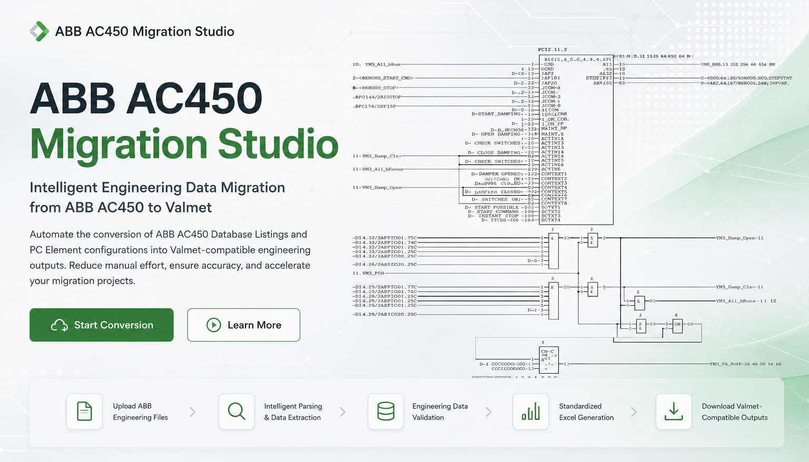
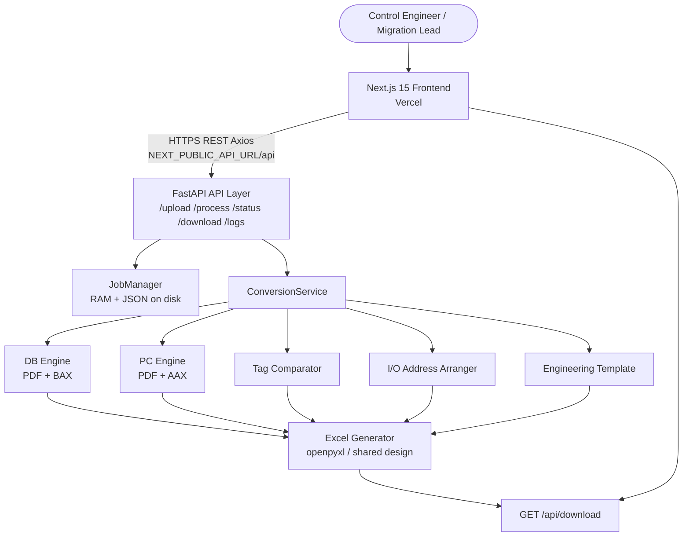

<p align="center">
  
</p>

<p align="center">
  
</p>

<h1 align="center">ABB AC450 Migration Studio</h1>

<h3 align="center">Enterprise Engineering Migration Platform</h3>

<p align="center">
  <em>From ABB Advant Controller 450 source truth to Valmet-ready engineering deliverables — parsed, validated, clubbed, and exported with auditability.</em>
</p>

<p align="center">
  
  
  
  
  
  
  
  
  
  
</p>

| Attribute | Value |
|-----------|-------|
| **Current Version** | `1.0.0` (`backend/core/config.py` → `VERSION`) |
| **Project Status** | Production-ready engineering workstation (v1) |
| **Production Status** | Live — Vercel frontend connected to Render API |
| **License** | Proprietary / project-defined (no public `LICENSE` file is shipped) |
| **Author / Maintainer** | [vedantlanjekar-official](https://github.com/vedantlanjekar-official) |
| **Last Updated** | 15 August 2026 |
| **Repository Name** | [ABB-AC450-Migration-Studio](https://github.com/vedantlanjekar-official/ABB-AC450-Migration-Studio) |

---

## Technology Configuration

This section is the single inventory of technologies that actually ship in the repository. The product UI is a **custom Valmet-branded Tailwind design**. The frontend framework is **Next.js 15 (App Router)**, not Vite. There is **no ShadCN** dependency; icons come from Lucide and motion from Framer Motion.

### Frontend

| Technology | Role in this project |
|------------|----------------------|
| **React 18** | Component model for the landing page, module picker, dropzone, processing view, and results grid |
| **TypeScript** | Compile-time contracts for `ConversionType`, job status payloads, and API clients |
| **Next.js 15** | App Router hosting, production build on Vercel, optional `/api/*` rewrites in development |
| **Tailwind CSS 3** | Valmet green / slate industrial styling, responsive layout, results table chrome |
| **Custom Valmet UI** | Project-owned components (`header`, `dropzone`, `results_view`, `workflow_cards`) instead of a generic component kit |
| **React Hooks** | Local UI state (search, sheet tabs, log modal loading) |
| **TanStack React Query** | Installed for future/async query patterns; **job lifecycle state is owned by Zustand** |
| **Zustand** | Pipeline stage (`upload` / `processing` / `results`), selected module, files, `job_id`, status payload |
| **Axios** | Multipart upload, process trigger, status polling, log fetch (300 s timeout) |
| **Framer Motion** | Landing-page motion on `framer_landing.tsx` |
| **Lucide React** | Engineering icons (download, sheets, warnings, CPU, shield) |
| **clsx / tailwind-merge** | Conditional class composition |

### Backend

| Technology | Role in this project |
|------------|----------------------|
| **Python 3.11** | Runtime on Render (`PYTHON_VERSION=3.11.0`) and local `.tools/python` |
| **FastAPI** | REST surface under `/api` plus `/health` |
| **Uvicorn** | ASGI server — one worker in production (`--workers 1`) |
| **Pydantic v2** | Request/response models (`ProcessRequest`, `ProcessStatusResponse`, `EngineeringIO`) |
| **pydantic-settings** | `Settings` for temp dirs, upload limits, light-PDF flags |
| **python-multipart** | Multipart file uploads |
| **Thread-pool executor** | Long conversions run off the event loop so health checks stay responsive |

### File Processing

| Technology | Role in this project |
|------------|----------------------|
| **pdfplumber** | Layout-aware PDF text for DB printouts |
| **PyMuPDF (`fitz`)** | Primary/light PDF path for PC diagrams; fallback fusion with pdfplumber |
| **ABB AAX parser** | `backend/pc_element/parser/aax_reader.py` — multi-stage PC export reader (pages, blocks, hardwired I/O, PCU `:IOADDR`/`:CHANNEL`, MOVE/PIDCON joins) |
| **ABB BAX parser** | `backend/parser/bax_reader.py` — DB element native export companion to PDF |
| **openpyxl** | Workbook write/read for I/O lists, comparison reports, address sheets, templates |
| **XlsxWriter** | Alternate Excel writer used where high-volume sheet generation benefits |
| **pandas** | Tabular shaping in selected Excel workflows |
| **OCR (optional)** | Pillow / Tesseract path exists behind `ENABLE_PC_OCR`; **disabled in production** (`0`) to avoid Render OOM |

### Deployment

| Technology | Role in this project |
|------------|----------------------|
| **GitHub** | Source of truth; `main` auto-deploys Render and Vercel |
| **Vercel** | Next.js production frontend |
| **Render** | FastAPI production backend (free/web service, Oregon, health `/health`) |

### Development Tools

| Technology | Role in this project |
|------------|----------------------|
| **Cursor IDE** | Primary engineering workstation for this repository |
| **Git** | Version control (`main` tracks `origin`) |
| **npm** | Frontend install / `next dev` / `next build` |
| **pip** | `pip install -r requirements.txt` (root file is what Render uses) |
| **pytest** | Backend regression (`backend/tests`) |
| **Docker** | **Not used in v1.** Deploy is Git → Vercel + Render, not a container image |

---

## Table of Contents

1. [What is ABB AC450 Migration Studio?](#what-is-abb-ac450-migration-studio)
2. [Live Production Links](#live-production-links)
3. [Key Features](#key-features)
4. [System Architecture](#system-architecture)
5. [Complete Workflow](#complete-workflow)
6. [Engineering Modules](#engineering-modules)
   - [Module 1 — DB Element Converter](#module-1--db-element-converter)
   - [Module 2 — PC Element Converter](#module-2--pc-element-converter)
   - [Module 3 — Engineering Tag Comparator](#module-3--engineering-tag-comparator)
   - [Module 4 — I/O Address Generator](#module-4--io-address-generator)
   - [Module 5 — ABB Engineering Template Generator](#module-5--abb-engineering-template-generator)
7. [User Guide](#user-guide)
8. [Developer Guide](#developer-guide)
   - [Project Architecture](#project-architecture)
   - [Folder Structure](#folder-structure)
   - [Backend](#backend)
   - [Frontend](#frontend)
   - [APIs](#apis)
   - [Processing Engines](#processing-engines)
   - [Deployment](#deployment)
   - [Performance](#performance)
   - [Security](#security)
   - [Future Scope](#future-scope)
9. [System Ratings](#system-ratings)
10. [A Message to Developers](#a-message-to-developers)
11. [Contributors](#contributors)
12. [Related Documentation](#related-documentation)
13. [Appendix — Glossary, Contracts, and Onboarding](#appendix--glossary-contracts-and-onboarding)
14. [Environment Variable Catalog](#environment-variable-catalog)
15. [Excel Column Contracts](#excel-column-contracts)

---

## What is ABB AC450 Migration Studio?

**ABB AC450 Migration Studio** is an enterprise web platform that converts ABB Advant Controller 450 engineering dumps into Valmet-compatible Excel workbooks. It was built because brownfield pulp-and-paper and process sites still run AC450, while migration programs need structured Loop Tags, Device Tags, I/O families, and card/channel addresses without weeks of manual re-keying. The Studio automates PDF, BAX, and AAX parsing, default inheritance, clubbing, comparison, address packing, and template population so engineering hours move from transcription to review. Business value is repeatable, auditable deliverables that import into Valmet DNA workflows. Typical use cases are mill area cutovers, twin-node PM2/PM3 extracts, and tag-list reconciliation. The audience is control engineers, migration leads, and software maintainers handing the tool to the next project team.

---

## Live Production Links

Production URLs only. Local workstation ports belong in the [Developer Guide](#developer-guide).

| Surface | URL |
|---------|-----|
| **Production Website** | [https://abb-ac450-migration-studio.vercel.app](https://abb-ac450-migration-studio.vercel.app) |
| **Frontend (Vercel)** | [https://abb-ac450-migration-studio.vercel.app](https://abb-ac450-migration-studio.vercel.app) |
| **Backend API (Render)** | [https://abb-ac450-migration-studio-backend.onrender.com](https://abb-ac450-migration-studio-backend.onrender.com) |
| **Health Probe** | [https://abb-ac450-migration-studio-backend.onrender.com/health](https://abb-ac450-migration-studio-backend.onrender.com/health) |
| **OpenAPI (Render)** | [https://abb-ac450-migration-studio-backend.onrender.com/docs](https://abb-ac450-migration-studio-backend.onrender.com/docs) |
| **GitHub Repository** | [https://github.com/vedantlanjekar-official/ABB-AC450-Migration-Studio](https://github.com/vedantlanjekar-official/ABB-AC450-Migration-Studio) |
| **Release Page** | [https://github.com/vedantlanjekar-official/ABB-AC450-Migration-Studio/releases](https://github.com/vedantlanjekar-official/ABB-AC450-Migration-Studio/releases) |

The browser calls `https://abb-ac450-migration-studio-backend.onrender.com/api` (see `frontend/services/api_client.ts`). CORS allows the Vercel origin. Render free-tier instances may cold-start; the first request after idle can take about thirty seconds.

---

## Key Features

| | Capability | What it does |
|---|------------|--------------|
| ① | **DB Element Conversion** | Parses AC450 database printouts (PDF or BAX), resolves `.DEFAULT` inheritance, clubs AI/AO and DO/DI families, writes a Valmet `Clubbed_IO` workbook |
| ② | **PC Element Conversion** | Parses PC diagrams (PDF) and native **AAX** exports; extracts eight I/O families, Device/Loop Tags, Slot/Card, Channel, Function Block Summary |
| ③ | **Engineering Tag Comparison** | Set-based `$(DEVICETAG)` match across two workbooks — not row-by-row — with matched/unmatched reports |
| ④ | **I/O Address Generation** | Packs clubbed records onto cards using family channel limits (AI/AO 16, DI/DO 32, 800-series AI/AO 8, DI/DO 32) |
| ⑤ | **ABB Engineering Template** | Maps clubbed pairs into `$(TAG)`, `$(DEVICETAG1/2)`, ranges, units, and package placeholders |
| ⑥ | **PDF Processing** | Dual-engine extraction (pdfplumber + PyMuPDF) with light-mode flags for constrained hosts |
| ⑦ | **AXX Processing** | Block-graph reader: hardwired `=AIcard.ch`, PCU `:IOADDR`/`:CHANNEL`, MOVE/PIDCON/MOTCON/VALVECON joins |
| ⑧ | **BAX Processing** | Native DB export path parallel to PDF so the same clubbing/Excel contract applies |
| ⑨ | **Excel Generation** | Shared industrial design (slate headers, zebra rows, formula-safe cells, Valmet header aliases) |
| ⑩ | **Intelligent Clubbing** | Loop-Tag pairing: AI→AO, DO→DI, AI800_→AO800_, DO800_→DI800_; valve SV1→GSO→GSC |
| ⑪ | **Function Block Detection** | Counts PIDCON, MOTCON, VALVECON, MANSTN (and catalog peers) independently of I/O rows |
| ⑫ | **High-Accuracy Extraction** | Grammar parser, duplicate keys `(family, card, channel, device_tag)`, completeness audit, warnings — no invented hardware addresses |

Multi-file DB or PC uploads concatenate into **one** workbook (`DB_Element.xlsx` / `PC_Element_IO_List.xlsx` when more than one source is present).

---

## System Architecture



### Layer responsibilities

| Layer | Responsibility |
|-------|----------------|
| **User** | Selects a module, uploads source files, reviews preview, downloads Excel, reads execution logs |
| **Frontend** | Valmet-branded SPA workflow; never parses PDF/AAX itself |
| **API Layer** | Validates uploads, queues jobs, returns typed status, streams workbooks and logs |
| **Backend services** | `ConversionService` routes `conversion_type`; `JobManager` persists progress; worker thread runs the engine |
| **Processing engines** | Domain rules for DB, PC, compare, address, template — isolated packages |
| **Excel generator** | Presentation only: headers, indicators, Slot/Card, Channel, sanitization — does not re-parse engineering |
| **Download service** | `FileResponse` of the completed workbook; filename follows module convention |

There is **no application database**. Jobs live in memory plus JSON under the host temp directory. That is correct for a conversion workstation and important on Render’s ephemeral disk: a dyno sleep after download requires a re-run.

---

## Complete Workflow


| Stage | What happens |
|-------|----------------|
| **Upload File** | `POST /api/upload` accepts PDF, BAX, AAX, XLSX/XLSM/XLS up to 100 MB each. Names are sanitized. A `job_id` (UUID) is created. |
| **Parser Selection** | UI sends `conversion_type`: `DB`, `PC`, `COMPARE`, `IO_ARRANGE`, `ENG_TEMPLATE`. The backend does not guess the module from the file alone. |
| **Extraction Engine** | DB: PDF/BAX object + `:param` stream. PC: PDF layers or AAX block graph → synthesized `=CATcard.ch/DeviceTag`. Compare/Arrange/Template read Excel headers. |
| **Validation** | Families limited to the eight supported I/O types. Tags must contain letters. Card/channel ≥ 0. Invalid refs are counted, not silently invented. |
| **Processing** | Defaults merge (DB), completeness audit (PC), set difference (compare), card packing (arrange), pair assembly (template). Heartbeats keep the job alive. |
| **Mapping** | Category → eight indicator columns. Loop Tag / Device Tag / Description renamed to `$(TAG)`, `$(DEVICETAG)`, `$(NAME_40)` on export. |
| **Generation** | Styled `.xlsx` written under `OUTPUT_DIR`. Preview rows (PC: Slot/Card and Channel immediately after Device Tag) stored on the job. |
| **Download** | `GET /api/download/{job_id}` after `status=completed`. Preview remains in the results grid. |

Engineers should treat the Excel as a **reviewed deliverable**, not an automatic write-back into Valmet or ABB runtimes.

---

## Engineering Modules

All five engines share one job API. They do **not** share parsers. Changing clubbing in PC must not rewrite DB inheritance, and vice versa.

### Module 1 — DB Element Converter

**Purpose.** Turn AC450 database listings into a single clubbed I/O workbook with inherited defaults, descriptions, ranges, and category indicators.

**Input.** One or more `.pdf` DB printouts and/or `.bax` native exports. Multiple files are parsed separately (within-file tag dedup) and concatenated into one Excel.

**Supported formats.** PDF (selectable text), BAX. Scanned-only PDFs without OCR will under-extract.

**Parsing logic.** Header lines such as `AI 1.1` / `AI800 2` identify objects. Colon parameters (`:NAME`, `:DESCR`, `:ADDR`, ranges, units) are tokenized. Unsupported types (AIC, AOC, DAT, TEXT, …) are skipped. Hardware vs software `.DEFAULT` blocks are detected and merged onto instances.

**Default value logic.** Family defaults fill missing parameters. Object-level values always win (`object_overrides`). Metrics exposed: `default_sections_found`, `parameters_filled_from_defaults`, `object_overrides`.

**Validation.** Eight I/O families only. Header/footer noise stripped (`ignored_header_footer_lines`).

**Clubbing.** Same Loop Tag: AI then AO; DO then DI; 800-series equivalents; valves SV1 → GSO → GSC. Unpaired rows remain — no fake mate is invented.

**Excel output.** Primary sheet `Clubbed_IO` (or the project’s DB sheet contract) with Valmet aliases. Multi-file name: `DB_Element.xlsx`.

**Processing pipeline.**

1. Read PDF/BAX pages  
2. Clean headers/footers  
3. Detect objects and defaults  
4. Extract parameters  
5. Inherit defaults  
6. Map Loop Tag / Device Tag  
7. Club + format  
8. Write Excel + preview  

---

### Module 2 — PC Element Converter

**Purpose.** Extract hardwired and soft I/O references from PC diagrams and AAX function-block exports, with Slot/Card and Channel when the source stores them.

**PDF parsing.** `PDFReader` fuses PyMuPDF (light mode default) with pdfplumber. `IOReferenceDetector` uses ReDoS-safe patterns, line-pair stitching, and spatial token assembly. `GrammarParser` accepts `=AI1.1/TAG`, `=AI800_22.5:22/TAG:ERR`, port and no-channel forms.

**AXX parsing.** `AaxReader` is a seven-stage engine:

| Stage | Work |
|-------|------|
| 0 | Encoding (utf-8-sig, utf-8, cp1252, latin-1) |
| 1 | Header metadata |
| 2 | `PCD-PAGE` split |
| 3 | Block segment + continuation join |
| 4A–4E | Hardwired `=AIcard.ch`, soft dotted/colon tags, DBINST, broken lines |
| 4F | PCU-I / PCU-O → Slot = `:IOADDR`, Channel = `:CHANNEL` |
| 4G | Same-block join (PIDCON `:MV` + `:DBINST`, MOVE `:21`/`:22`, MOTCON/VALVECON ports) |
| 5–6 | Global rescan + warnings |

Soft tags without hardware remain `CAT0.0`. The reader **does not invent** card numbers from the DB. Most mill AAX files are application wiring; physical `:ADDR` lives in the DB.

**I/O detection.** Families: AI, AO, DI, DO, AI800_, AO800_, DI800_, DO800_. Synthesized lines `=CAT{card}.{ch}/DeviceTag` feed the same grammar as PDF.

**Device Tag logic.** Full printed tag including suffixes (`.MV`, `.POUT`, `.SPEEDMV`, `:SELECTED` stripped as attributes). Trailing underscores (`.ST_`) are preserved.

**Loop Tag logic.** Derived from Device Tag (suffix stripped) for clubbing parity with DB.

**Function Block Summary.** Independent sheet: PIDCON, MOTCON, VALVECON, MANSTN, … declaration counts — not I/O row counts.

**Engineering rules.** Duplicate key = `(io_family, card_number, channel_number, device_tag)`. Completeness auditor compares inventory vs extraction.

**Validation.** `card_number` / `channel_number` ≥ 0. Channel `0` means “no channel in source,” shown blank in Excel/preview.

**Output.** `I_O_List` columns:

`Sr. No. | $(TAG) | $(NAME_40) | $(DEVICETAG) | Slot/Card | Channel | AI | AO | DI | DO | AI800_ | AO800_ | DI800_ | DO800_`

Freeze panes keep identity + address visible. Soft rows leave Slot/Card and Channel empty. Multi-file name: `PC_Element_IO_List.xlsx`.

**Spot checks (`.AXX Data` corpus).** `82PIC972.MV` → 7.10; `82PIC972.POUT` → 3.9; `82M140.SPEEDMV` → 192.1. Technical write-up: [`docs/aax_slot_channel_report.md`](docs/aax_slot_channel_report.md).

---

### Module 3 — Engineering Tag Comparator

**Purpose.** Reconcile two engineering workbooks by Device Tag set, not by row alignment.

**Input files.** Exactly two Excel files (`.xlsx` / `.xlsm` / `.xls`).

**Matching algorithm.** Extract `$(DEVICETAG)` (or `DEVICE TAG` / `NAME`) from each workbook. Compare case-insensitive trimmed sets. Duplicates inside a file are counted separately.

**Device Tag matching.** Order is irrelevant. A tag present in both sets is matched once.

**Reporting.** Sheets for matched tags, unmatched-in-file-1, unmatched-in-file-2, plus a numeric summary (`worksheet1_records`, `matched_records`, `unmatched_records`).

**Summary.** Download name: `Comparison_Report.xlsx`.

**Accuracy.** Deterministic set math. False “unmatched” usually means header alias mismatch or a suffix difference (`.MV` vs bare loop). Confirm both files use the same Valmet header contract.

---

### Module 4 — I/O Address Generator

**Purpose.** Allocate sequential ABB-style addresses from an already-generated DB or PC workbook.

**Address allocation.** Records grouped by category indicator columns. Each family has a channel capacity:

| Family | Channels per card |
|--------|-------------------|
| AI, AO | 16 |
| AI800_, AO800_ | 8 |
| DI, DO, DI800_, DO800_ | 32 |

**Card logic.** Card index grows with dataset size. Excel’s 16,384-column limit is the practical ceiling, not a fictional AC450 card cap.

**Channel logic.** Channels fill 1..N then roll to the next card. Preview columns `$(TAG) {n}` / `$(DEVICETAG) {n}`.

**ABB hardware limits.** Encoded as `CHANNELS_PER_CARD` in `backend/io_address_arrangement/arranger.py`. Changing a limit is a one-map edit plus tests.

**Address sequencing.** Categories emit as separate worksheets so analog and digital packing never interleave.

**Output.** `IO_Address_Arrangement.xlsx`.

---

### Module 5 — ABB Engineering Template Generator

**Purpose.** Populate a Valmet/ABB import template from clubbed DB or PC Excel.

**Template population.** Adjacent compatible pairs (AI+AO, DI+DO, 800-series) with the same Loop Tag become one template row. Input occupies slot 1; output occupies slot 2.

**Mapping rules.** Headers resolved by alias lists (`$(DEVICETAG)`, `DEVICE TAG`, `NAME`, …).

**Device Tag mapping.** `$(DEVICETAG1)` / `$(DEVICETAG2)` from the pair. Unpaired clubs still emit with the second device blank.

**Placeholder population.**

| Placeholder | Source |
|-------------|--------|
| `$(TAG)` | Loop Tag |
| `$(NAME40_1)` | Description / `$(NAME_40)` |
| `$(CARDTYPE1/2)` | Category of each member |
| `$(DEVICETAG1/2:MIN/MAX/UNIT)` | Range and unit columns when present |
| `$(PACKAGE)`, `$(EXE)`, `$(CTRLROOM)`, `$(ALGROUP)`, Process Area ID | Optional source headers |

**Engineering variables.** Defined in `TEMPLATE_COLUMNS` inside `backend/engineering_template/generator.py`.

**Export.** Sheet `Engineering_Template`. Download name: `ABB_Engineering_Template.xlsx`.

---

## User Guide

The UI is a three-stage pipeline: **Upload → Processing → Results**. Pick a module on the landing page, then follow the dropzone for that module.

> **Screenshot placeholder:** `docs/screenshots/01-landing-modules.png` — five service cards (DB, PC, Compare, I/O Address, Template).

### DB Element Converter

| | |
|--|--|
| **Purpose** | Convert AC450 DB listings to clubbed Valmet Excel |
| **When to use** | You have DB printouts or BAX dumps for an area/node |
| **Formats** | PDF, BAX (multi-file allowed) |
| **Expected output** | One workbook, clubbed I/O, inherited defaults |

**Steps**

1. Open the [production website](https://abb-ac450-migration-studio.vercel.app).  
2. Select **DB Element Converter**.  
3. Drag PDF/BAX files (≤ 100 MB each).  
4. Start conversion. Watch phase text and percent.  
5. On success, preview sheets and **Download Excel**.  
6. Optional: **View Execution Log**.

**Tips.** Prefer text-based PDFs. Combine area files in one job when you want a single workbook. Review override vs default metrics.

**Common mistakes.** Uploading a PC diagram as DB. Expecting Slot/Card from a DB file that never printed `:ADDR`. Re-downloading after a Render sleep (temp files are gone — re-run).

> **Screenshot placeholder:** `docs/screenshots/02-db-dropzone.png`

### PC Element Converter

| | |
|--|--|
| **Purpose** | Extract PC I/O, tags, Slot/Card, Channel, function blocks |
| **When to use** | PC diagram PDFs or AAX exports |
| **Formats** | PDF, AAX (multi-file → one `PC_Element_IO_List.xlsx`) |
| **Expected output** | `I_O_List` + `Function Block Summary` |

**Steps**

1. Select **PC Element Converter**.  
2. Upload PDF and/or AAX.  
3. Process and wait for “PC Element IO Extraction Complete”.  
4. In the grid, Slot/Card and Channel sit **beside Device Tag** (highlighted).  
5. Search a known tag (example: `82PIC972.MV`) to confirm 7 / 10 when that hardware exists in the AAX.  
6. Download Excel. Columns stay frozen while you scroll indicators.

**Tips.** Empty Slot/Card means the AAX/PDF has no board for that signal (DAT, comms, internals). Do not invent numbers. Use the matching DB job for `:ADDR`.

**Common mistakes.** Looking only at Function Block Summary (no addresses there). Assuming every row must have a card. Uploading BAX as PC.

> **Screenshot placeholder:** `docs/screenshots/03-pc-results-slot-channel.png`

### Engineering Tag Comparator

| | |
|--|--|
| **Purpose** | Diff two tag lists |
| **When to use** | After two conversions, or vendor vs site list |
| **Formats** | Two Excel workbooks |
| **Expected output** | `Comparison_Report.xlsx` |

**Steps:** choose Comparator → upload Worksheet 1 and Worksheet 2 → process → review matched/unmatched counts → download.

**Tips.** Both files should expose `$(DEVICETAG)` or a recognized alias.

**Common mistakes.** Comparing a Loop Tag column to a Device Tag column. Expecting row-order matching.

### I/O Address Generator

| | |
|--|--|
| **Purpose** | Pack tags onto cards/channels |
| **When to use** | After a successful DB or PC Excel exists |
| **Formats** | One generated `.xlsx` |
| **Expected output** | `IO_Address_Arrangement.xlsx` |

**Steps:** select I/O Address Generator → upload the generated workbook → process → inspect per-family sheets → download.

**Tips.** Fix category indicators on the source workbook first; the arranger reads those columns.

**Common mistakes.** Uploading a raw ABB PDF. Editing addresses by hand then re-running without saving a new source.

### ABB Engineering Template Generator

| | |
|--|--|
| **Purpose** | Build import-shaped rows from clubbed pairs |
| **When to use** | Last step before Valmet template import |
| **Formats** | One generated DB/PC Excel |
| **Expected output** | `ABB_Engineering_Template.xlsx` |

**Steps:** select Template → upload clubbed workbook → process → verify `$(TAG)` / `$(DEVICETAG1)` / `$(DEVICETAG2)` → download.

**Tips.** Compatible pairs must share a Loop Tag and sit in clubbing order.

**Common mistakes.** Feeding a comparison report. Expecting every analog to have a paired output if the source never had one.

### Cross-module sequence (recommended)

1. DB conversion (area listing)  
2. PC conversion (diagrams / AAX)  
3. Comparator (DB Device Tags vs PC Device Tags)  
4. I/O Address Generator on the accepted workbook  
5. Engineering Template for import  

Archive the Excel **and** the execution log with the job date. Render will not keep them.

---

## Developer Guide

### Project Architecture

**Frontend architecture.** Next.js App Router (`frontend/app/page.tsx`) renders a single conversion workstation. Zustand holds the session. `use_file_upload` / `use_status_polling` drive Axios. Results read `preview_data` and `generated_sheets`. No parser code runs in the browser.

**Backend architecture.** `backend/main.py` mounts routers, CORS `allow_origins=["*"]`, dual health paths. `ConversionService.run_conversion_pipeline` switches on type. Engines return objects + preview + `excel_file_path`.

**API architecture.** Prefix `/api`. Upload is multipart; process/status are JSON; download is a file; logs are plain text.

**Service architecture.** `JobManager` (create, heartbeat, persist JSON, stale-fail). `pipeline_executor` (thread pool, `is_job_running`). Conversion service (five pipelines, combined multi-file Excel).

**Processing engine architecture.** Each engine is a package with reader → detect/parse → validate → club/format → Excel. Shared pieces: `backend/excel/design.py`, `header_postprocessor.py`, `mapper/category_mapper.py`.

### Folder Structure

```text
ABB AC450 Migration Studio/
├── frontend/                    # Next.js 15 UI (Vercel)
│   ├── app/                     # App Router pages, layout, providers
│   ├── components/              # Dropzone, results, processing, landing
│   ├── hooks/                   # Upload + status polling
│   ├── services/api_client.ts   # Production Render URL + local 8002
│   ├── store/                   # Zustand session
│   ├── types/                   # ConversionType, status DTO
│   └── public/                  # Brand assets
├── backend/
│   ├── api/                     # upload, process, status, download, logs
│   ├── core/                    # settings, logging
│   ├── schemas/                 # Pydantic API models
│   ├── services/                # ConversionService, JobManager, executor
│   ├── parser/                  # DB PDF + BAX
│   ├── extractor/               # :param extraction
│   ├── mapper/                  # Clubbing, category indicators, formatter
│   ├── excel/                   # Shared workbook design
│   ├── pc_element/parser/       # Production PC + AAX pipeline
│   ├── pc_parser/               # Legacy PC helpers (do not fork blindly)
│   ├── excel_compare/           # Tag comparator
│   ├── io_address_arrangement/  # Card/channel packer
│   ├── engineering_template/    # Template rows
│   ├── models/                  # Legacy PC element model
│   ├── utils/                   # Filenames, combined export names
│   └── tests/                   # pytest suite + fixtures
├── docs/                        # Architecture, PC module, AAX reports, deploy analysis
├── scripts/                     # Corpus analysis / diagnostics (not production)
├── examples/                    # Tiny sample PDF generator
├── requirements.txt             # Render install
├── render.yaml                  # Backend blueprint
├── vercel.json                  # Monorepo Next build
├── start_dev.bat                # Windows: API :8002 + UI :5180
└── README.md                    # This document
```

Temp uploads/outputs/logs are **not** in git. They are created under the OS temp dir (`/tmp/abb_ac450/...` on Render).

### Backend

**FastAPI.** `app` in `backend/main.py`. Routers mounted at `settings.API_PREFIX` (`/api`).

**Routes.** See [APIs](#apis).

**Services.** `ConversionService` is the only place that chooses an engine. Do not call Excel generators from routers.

**Engines.** DB (`parser` + `mapper` + `excel`). PC (`pc_element.parser`). Compare, arrange, template as named packages.

**Utilities.** `sanitize_filename`, `pdf_to_excel_filename`, `combined_export_filename`, `unique_output_path`.

**Validation.** Upload extension + size. Process 404 on unknown job. Download 400 if not completed. PC `Validator` rejects negative addresses and empty tags.

**Logging.** Per-job `{job_id}.log` plus structured logger `pc_element_parser` / conversion stages. Heartbeats refresh `updated_at` so stale jobs can be failed after 300 s without a heartbeat.

### Frontend

**Components.** `framer_landing`, `workflow_cards`, `dropzone`, `processing_view`, `results_view`, `data_grid_preview`, `log_modal`, `header`, `feature_cards`.

**Pages.** Single page application at `/`. No extra Next routes for modules.

**Routing.** Module choice is Zustand `conversionType`, not a URL path.

**State.** `converter_store.ts` — files per module, `jobId`, `statusResponse`, log modal.

**API integration.** `api_client.ts` — localhost → `http://127.0.0.1:8002/api`; production → Render `/api` unless `NEXT_PUBLIC_API_URL` is a non-local https URL.

**Upload.** Dropzone builds `File[]` (or two files for compare). `uploadFiles` posts field name `files`.

**Download.** Anchor to `getDownloadUrl(jobId)` after completion.

### APIs

Base path: `{host}/api`. Host in production: `https://abb-ac450-migration-studio-backend.onrender.com`.

#### `GET /health` and `GET /api/health`

| | |
|--|--|
| **Purpose** | Liveness + writable temp dirs |
| **Status** | `200` |
| **Response** | `{ "status": "online" \| "degraded", "project": "...", "version": "1.0.0", "filesystem": { "writable": true, ... } }` |

#### `POST /api/upload`

| | |
|--|--|
| **Request** | `multipart/form-data`, repeated field `files` |
| **Success** | `200` `FileUploadResponse` |
| **Errors** | `400` no files / bad extension / over 100 MB |

```json
{
  "job_id": "5e2d00bb-f09c-4067-a312-f58b12157bba",
  "uploaded_files": ["sample_pc.aax"],
  "total_files": 1,
  "message": "Uploaded 1 file(s) successfully. Job ID: 5e2d00bb-f09c-4067-a312-f58b12157bba"
}
```

#### `POST /api/process`

| | |
|--|--|
| **Body** | `{ "job_id": "<uuid>", "conversion_type": "DB" \| "PC" \| "COMPARE" \| "IO_ARRANGE" \| "ENG_TEMPLATE" }` |
| **Success** | `200` `{ job_id, conversion_type, status: "queued", message }` |
| **Errors** | `404` unknown job |
| **Idempotency** | If already running and not stale, returns “already processing.” Stale jobs are re-queued. |

#### `GET /api/status/{job_id}`

| | |
|--|--|
| **Success** | `200` `ProcessStatusResponse` |
| **Errors** | `404` unknown job |

Important fields: `status`, `progress_percentage`, `current_phase`, `message`, `conversion_type`, `total_objects`, family counts, comparator counts, `generated_sheets`, `preview_data`, `warnings`, `errors`, `updated_at`.

Statuses include `queued`, `reading_pdf`, `extracting_text`, `detecting_elements`, `parsing_parameters`, `grouping_elements`, `generating_excel`, `completed`, `failed`.

#### `GET /api/download/{job_id}`

| | |
|--|--|
| **Success** | `200` `application/vnd.openxmlformats-officedocument.spreadsheetml.sheet` |
| **Errors** | `400` not completed; `404` job or file missing (typical after Render restart) |

Filenames: source basename `.xlsx` (DB/PC), `Comparison_Report.xlsx`, `IO_Address_Arrangement.xlsx`, `ABB_Engineering_Template.xlsx`.

#### `GET /api/logs/{job_id}`

Plain text. If the log file does not exist yet, a placeholder sentence is returned (not 404).

#### Error handling

Routers raise `HTTPException`. Engine failures set job `status=failed`, append `errors`, and keep the UI on the results banner. Clients should poll until `completed` or `failed` (frontend polls up to a long window; Axios timeout is 300 s per call).

#### Example PC job (production)

```http
POST /api/upload
POST /api/process
{"job_id":"<id>","conversion_type":"PC"}
GET  /api/status/<id>
GET  /api/download/<id>
```

Verified 15 August 2026 against Render with `sample_pc.aax`: 11 I/O rows; `82PIC972.MV` Slot 7 Channel 10; preview key order Device Tag → Slot/Card → Channel.

### Processing Engines

| Engine | Parser | Validation | Mapping | Clubbing | Generation | Export |
|--------|--------|------------|---------|----------|------------|--------|
| DB | PDF/BAX AST + defaults | Family + params | Loop/Device/DESCR | RecordClubber | Clubbed_IO | `.xlsx` |
| PC | PDF detector + AaxReader | Grammar + Validator + auditor | Indicators + address cells | PC RecordClubber + OutputFormatter | I_O_List + FB Summary | `.xlsx` |
| Compare | Header scan | Two files required | Device Tag sets | N/A | Report sheets | Comparison_Report |
| Arrange | Header + indicators | Known categories | Card/channel math | N/A | Per-family sheets | IO_Address_Arrangement |
| Template | Header aliases | Compatible pairs | Placeholders | Adjacent clubs | Engineering_Template | ABB_Engineering_Template |

**Never** put new regex in `excel_generator.py`. Address resolution belongs in `aax_reader` / grammar; Excel only prints `EngineeringIO`.

### Deployment

```text
GitHub main
   ├─ Vercel  → Next.js UI
   └─ Render  → uvicorn backend.main:app --host 0.0.0.0 --port $PORT --workers 1
         UI ──HTTPS──► Render /api
```

**GitHub.** Canonical remote: `https://github.com/vedantlanjekar-official/ABB-AC450-Migration-Studio.git`. `render.yaml` `autoDeploy: true` on `main`.

**Vercel.** Project `abb-ac450-migration-studio`. Root `vercel.json` installs/builds `frontend`. Set **production** env:

| Variable | Value |
|----------|--------|
| `NEXT_PUBLIC_API_URL` | `https://abb-ac450-migration-studio-backend.onrender.com/api` |

Must include `/api`. This is inlined at **build** time.

**Render.** Service `abb-ac450-migration-studio-backend`.

| Item | Value |
|------|--------|
| Build | `pip install -r requirements.txt` |
| Start | `uvicorn backend.main:app --host 0.0.0.0 --port $PORT --workers 1` |
| Health | `/health` |
| `PYTHON_VERSION` | `3.11.0` |
| `PC_LIGHT_PDF_READ` | `1` |
| `DB_LIGHT_PDF_READ` | `1` |
| `ENABLE_PC_OCR` | `0` |

**Common issues**

| Symptom | Cause | Fix |
|---------|--------|-----|
| UI loads, process fails | Wrong/missing `NEXT_PUBLIC_API_URL` or cold start | Confirm `/health`; retry; rebuild Vercel after env change |
| Download 404 | Ephemeral disk after sleep | Re-run conversion |
| CLI deploy `fetch failed` ~78 MB | Uploading `.AXX Data` / `.tools` | Use GitHub auto-deploy; keep `.vercelignore` |
| AAX rows all blank Slot/Card | File has no hardware tokens | Expected; use DB for `:ADDR` |
| Stuck `reading_pdf` | Worker OOM / stale | Status endpoint marks stale failed; re-queue |

**Local development (not production links)**

```bat
start_dev.bat
```

Frontend `http://localhost:5180`, API `http://127.0.0.1:8002`.  
`pip install -r requirements.txt` then `uvicorn backend.main:app --reload --host 127.0.0.1 --port 8002`.  
`cd frontend && npm install && npm run dev`.  
`pytest backend/tests -q`.

### Performance

| Topic | Guidance |
|-------|----------|
| **Speed** | Small AAX/PDF: seconds. Large PC PDFs: minutes (text fusion + candidate scan) |
| **Scalability** | Single Uvicorn worker; in-memory jobs — horizontal scale needs shared store + object storage |
| **Memory** | Light PDF flags on; OCR off on free Render (512 MB class) |
| **Large files** | 100 MB cap; detector caps (`MAX_SOURCE_CHARS`, `MAX_LINE_CHARS`) |
| **Recovery** | Heartbeats; stale fail; user re-upload |

### Security

| Control | Implementation |
|---------|----------------|
| **File validation** | Extension allow-list + 100 MB |
| **Input validation** | Pydantic bodies; sanitized filenames |
| **Temp storage** | Job-scoped dirs under system temp; not committed |
| **Excel safety** | Strings starting with `=`, `+`, `@` stripped before write |
| **CORS** | Open `*` for this public engineering tool — tighten if the service is locked to a corporate origin |
| **Auth** | None in v1 — treat as an internal workstation, not a multi-tenant SaaS |
| **Secrets** | `.env*` local files gitignored; never commit Vercel OIDC / tokens |

### Future Scope

- AI-assisted description / low-confidence tag review  
- Learned layout models for degraded scans  
- OCR on by default only on hosts with ≥ 2 GB RAM  
- Additional ABB families (MasterPiece variants, AC800M extracts)  
- Project-level batch queues and consolidated coverage reports  
- Shared object storage so downloads survive Render sleep  
- Multi-language UI (engineering tags stay ASCII)  
- Optional SSO and stricter CORS for plant networks  
- Docker Compose for air-gapped engineering laptops  

Non-goals of v1: live OPC/DCS, push-to-Valmet-without-review, billing, mobile apps.

---

## System Ratings

Ratings reflect the **shipped v1.0.0** on 15 August 2026 (local pytest + production AAX smoke on Render). They are engineering judgments, not marketing scores.

### Table 1 — Engineering modules

| Component | Rating (/10) | Comments |
|-----------|-------------:|----------|
| DB Element Converter | 8.6 | Strong default inheritance, clubbing, and multi-file combine. Still PDF-quality dependent. |
| PC Element Converter | 8.7 | AAX stages 4F/4G plus PDF grammar; Slot/Card visible in results. Soft rows correctly stay blank. |
| Engineering Tag Comparator | 8.1 | Correct set semantics; limited when headers drift from aliases. |
| I/O Address Generator | 8.2 | Clear channel map; grows cards instead of inventing a fake hardware cap. |
| ABB Engineering Template Generator | 8.0 | Placeholder coverage is solid; optional plant columns need clean source headers. |

### Table 2 — Platform qualities

| Component | Rating (/10) | Comments |
|-----------|-------------:|----------|
| Frontend | 8.3 | Clear three-stage UX; Slot/Card highlighted. No deep linking per module. |
| Backend | 8.6 | Clean engine isolation and job heartbeats. Ephemeral storage is the main ops constraint. |
| API Layer | 8.5 | Small, consistent surface; stale-job retry is production-aware. |
| UI/UX | 8.2 | Valmet visual language; horizontal address columns no longer hide off-screen. |
| Processing Accuracy | 8.4 | Golden AAX spots hold; 26/32 corpus files have no HW tokens by nature of PC vs DB split. |
| Architecture | 8.6 | Five engines, one job API, shared Excel design. |
| Maintainability | 8.3 | Tests around AAX, multi-file Excel, clubbing. Dual `pc_parser` vs `pc_element` needs discipline. |
| Deployment Readiness | 8.4 | Live Vercel↔Render path proven. Cold start and disk loss must be explained to users. |
| Documentation | 8.8 | This README plus `docs/` module reports. |
| **Overall Project** | **8.5** | Fit for supervised mill migration work; not an unattended DCS writer. |

**Overall strengths.** Encoded ABB/Valmet rules; AAX hardware join without fabricating cards; combined multi-file Excel; observable jobs; production link verified.

**Areas for improvement.** Persist outputs off the dyno; optional auth; retire leftover `pc_parser` confusion; screenshot pack in `docs/screenshots/`; OCR only on larger hosts.

**Production readiness.** Yes, as an **internal engineering workstation** with human review of every workbook.

**Final engineering evaluation.** The Studio is a serious conversion compiler: parsers are conservative, Excel is contractual, and the five-module sequence matches how migration teams actually work. Protect those contracts more than you chase new UI chrome.

---

## A Message to Developers

If you are reading this because you inherited the Studio — welcome. Engineering software is a strange craft. You will spend an afternoon proving that `82PIC972.MV` is slot 7 channel 10, then another afternoon explaining why two hundred other rows have no slot at all. Both outcomes can be correct. The file simply never stored a board.

That is the work: sit with the source, refuse to invent data, write the join that *is* in the AAX, and leave a test so the next person does not re-learn it at 01:00 before a cutover.

You will debug a clubbing sort that looked cosmetic until a valve pair imported in the wrong order. You will rename a header and break a Valmet template. You will restart Render and wonder where the Excel went. You will also, once in a while, watch a whole area convert in seconds and remember why this tool exists — so a mill engineer does not retype a thousand tags.

Leave the engines isolated. Put new regex in the reader, not in the spreadsheet writer. Add a pytest when you change a family. Write the warning instead of a guessed card number. Refactor when the names lie. Review like the workbook will be printed and signed.

Build things that help people who will never read this repository. Then leave the repository kinder than you found it.

---

## Contributors

| Role | Name |
|------|------|
| Author / primary maintainer | [vedantlanjekar-official](https://github.com/vedantlanjekar-official) |
| Product context | Valmet / ABB AC450 migration engineering |
| Platform | Vercel (UI), Render (API), GitHub (`main`) |

Pull requests should name the module, the sheet contract impact, and the test that locks the behavior.

---

## Related Documentation

| Document | Contents |
|----------|----------|
| [`docs/architecture.md`](docs/architecture.md) | Historical converter architecture notes |
| [`docs/pc_element_module.md`](docs/pc_element_module.md) | PC pipeline design |
| [`docs/aax_parser_upgrade_report.md`](docs/aax_parser_upgrade_report.md) | AAX engine before/after |
| [`docs/aax_slot_channel_report.md`](docs/aax_slot_channel_report.md) | Slot/Card and Channel extraction |
| [`docs/deployment_analysis.md`](docs/deployment_analysis.md) | Cloud constraints and env contract |
| [`render.yaml`](render.yaml) | Backend blueprint |
| [`vercel.json`](vercel.json) | Frontend build |

---

## Appendix — Glossary, Contracts, and Onboarding

### Glossary

| Term | Meaning |
|------|---------|
| **AC450** | ABB Advant Controller 450 / MasterPiece-class DCS |
| **DB Element** | Database object listing (cards, parameters, defaults) |
| **PC Element** | Function-block / logic diagram or AAX export |
| **AAX** | PC application export (`PCD-PAGE`, PIDCON, MOVE, PCU-I/O) |
| **BAX** | DB native export |
| **Loop Tag** | Clubbing identity (`$(TAG)`) |
| **Device Tag** | Signal identity (`$(DEVICETAG)`) |
| **Slot/Card** | Board or PCU module address |
| **Channel** | Point on that board/module |
| **Clubbing** | Pairing I/O of one loop for import |
| **800-series** | `AI800_` / `AO800_` / `DI800_` / `DO800_` families |

### Stable contracts (do not break silently)

1. `ConversionType` in TypeScript matches backend routing strings.  
2. PC `I_O_List` includes Slot/Card and Channel immediately after Device Tag.  
3. Category indicators are the eight named columns; matching cell is `1`, others blank.  
4. Export header aliases: Loop Tag → `$(TAG)`, Device Tag → `$(DEVICETAG)`, Description → `$(NAME_40)`.  
5. Function Block Summary is independent of I/O row counts.  
6. Multi-file DB/PC jobs write **one** workbook.  
7. Soft AAX rows must not receive fabricated card numbers.

### Change impact

| Change | Verify |
|--------|--------|
| PC/AAX regex or 4F/4G join | `test_aax_parser.py` + golden tags |
| Clubbing order | Clubber tests + Excel visual |
| Header mapping | Header post-processor + template tests |
| Status DTO fields | `converter.ts` + results view |
| Env flags | Render health + one large PDF |

### Onboarding (four days)

1. Read this README through Complete Workflow. Run one DB and one PC job on production or local.  
2. Execute compare → address → template on those outputs.  
3. Clone, `pytest backend/tests -q`, step through `ConversionService`.  
4. Agree site tag conventions and acceptance thresholds with the migration lead.

### Release checklist

1. Bump `VERSION` and the README badge together.  
2. Note sheet/API contract deltas.  
3. Pytest green.  
4. Smoke DB + PC + one Excel module.  
5. Confirm Vercel build and Render `/health` after merge to `main`.  
6. Archive a sample workbook with the release.

### Frequently asked questions

**Why do most AAX rows have a blank Slot/Card?**  
PC AAX files are function-block diagrams. Hardware cards are stored in the DB (`:ADDR`). The PC reader only fills Slot/Card when the AAX itself contains `=AIcard.channel` or PCU `:IOADDR` + `:CHANNEL`. Blank is an honest answer.

**Why is Function Block Summary not equal to I/O row count?**  
Declarations (how many PIDCON blocks exist) are not the same as I/O records (how many tagged signals were emitted). Both are useful; they answer different questions.

**Can I upload PDF and AAX in one PC job?**  
Yes. Each file is parsed, objects are concatenated, function-block counts are summed, and one workbook is written.

**Why did download fail after I left the tab open?**  
Render’s filesystem is ephemeral. After idle spin-down the `.xlsx` is gone. Re-run the conversion.

**Where is Vite / ShadCN?**  
This product uses Next.js 15 and a custom Valmet Tailwind UI. Those names appear in generic stacks; they are not dependencies here. Do not add Vite alongside Next.js.

**Which requirements file does Render install?**  
The **root** `requirements.txt` (includes `pydantic-settings`). `backend/requirements.txt` is a subset and is not what the blueprint uses.

**How do I add a new I/O family?**  
Extend `GrammarParser.PREFIX_MAP`, detector prefix alternation, validator family set, and `CATEGORY_INDICATOR_COLUMNS`. Add tests. Do not special-case the family only in Excel.

**How do I add a function block to the summary?**  
Add the name to `SUPPORTED_FUNCTION_BLOCKS` in `function_block_extractor.py` and assert it in `test_aax_parser.py`. I/O extraction must not change.

### Detailed API examples

Upload (PowerShell):

```powershell
$api = "https://abb-ac450-migration-studio-backend.onrender.com"
$up = Invoke-RestMethod -Method Post -Uri "$api/api/upload" -Form @{
  files = Get-Item ".\backend\tests\fixtures\sample_pc.aax"
}
$up.job_id
```

Process and poll:

```powershell
Invoke-RestMethod -Method Post -Uri "$api/api/process" -ContentType "application/json" -Body (@{
  job_id = $up.job_id
  conversion_type = "PC"
} | ConvertTo-Json)

do {
  Start-Sleep 3
  $st = Invoke-RestMethod "$api/api/status/$($up.job_id)"
  $st.status
} while ($st.status -notin @("completed", "failed"))
```

Example completed fragment:

```json
{
  "status": "completed",
  "conversion_type": "PC",
  "total_objects": 11,
  "ai_count": 2,
  "ao_count": 4,
  "generated_sheets": ["I_O_List", "Function Block Summary"],
  "preview_data": {
    "I_O_List": [
      {
        "Sr. No.": 1,
        "Loop Tag": "82PIC972",
        "Device Tag": "82PIC972.MV",
        "Slot/Card": 7,
        "Channel": 10,
        "AI": 1
      }
    ]
  }
}
```

`conversion_type` aliases accepted by some Excel pipelines include `EXCEL` / `EXCEL_COMPARE` (compare), `IO_ADDRESS` / `ARRANGE` (arranger), `ENGINEERING_TEMPLATE` / `ABB_TEMPLATE` / `TEMPLATE` (template). Prefer the canonical five strings from the UI.

### PC Element engineering deep dive

PC diagrams print fragments such as `=AI7.10` on one line and `/82PIC972.MV` on the next. The detector stitches those. AAX is cleaner structurally but harder semantically: `:MV =AI7.10` does not include the plant tag on the same token. Stage 4G binds `:DBINST =82PIC972` to that hardware. MOVE blocks pair a plant port (`:21 =82PIC972:POUT`) with a hardware port (`:22 =AO3.9`). PCU-I/O never print `=AI192.1`; they print `:IOADDR 192` and `:CHANNEL 1` on a page titled `82M140: Reel Drum Speed`, which becomes `82M140.SPEEDMV`.

Downstream, `DuplicateDetector` keeps both a soft `0.0` row and a hardwired row if they are different keys. Clubbing groups by Loop Tag so the engineer sees AI then AO for the same loop. `OutputFormatter` then sections analog, digital, analog800, digital800. Excel and preview must copy `card_number` / `channel_number` unchanged — the display bug that hid addresses was column order, not missing extraction.

### DB Element engineering deep dive

DB listings are object-centric. A card object `AI1` may define defaults; instance `AI1.1` overrides `:NAME` and `:ADDR`. The inheritance builder merges hardware and software default profiles, counts fills vs overrides, and drops header/footer repetition. Clubbing uses the same Loop Tag derivation as PC so a later comparator can align Device Tags across the two workbooks. If you change Loop Tag derivation in one engine only, comparison quality collapses.

### Comparator, address, and template notes

Comparator extra-in-file-2 vs unmatched-in-file-1 are both first-class. Do not collapse them into a single “diff” column if Valmet reviewers need directionality.

Address generator preview is capped per family in the arranger (see `preview_rows[:100]` pattern). The downloaded workbook is complete; the UI preview is a sample.

Template `$(CARDTYPE1)` is the category of the input member of the pair. If a club is AO-only, the generator still emits a row — confirm with the project whether unpaired outputs are allowed in the import file.

### Frontend / backend contract checklist

- [ ] `ConversionType` union matches process body  
- [ ] Preview keys for PC include `Slot/Card` and `Channel` after `Device Tag`  
- [ ] Results grid does not treat numeric `0` as empty for real cards (production writes blanks for unresolved 0)  
- [ ] Download URL uses the same API host as upload  
- [ ] `generated_sheets` includes `Function Block Summary` even when that sheet has no preview rows  
- [ ] Warnings array is rendered, not only errors  

### Local smoke test (manual)

1. Run `start_dev.bat`.  
2. DB: upload a small PDF or `backend/tests/fixtures/sample_db.bax`.  
3. PC: upload `backend/tests/fixtures/sample_pc.aax`. Confirm Slot 7 / Channel 10 on `82PIC972.MV`.  
4. Compare the two Excels.  
5. Arrange the PC Excel.  
6. Template the PC Excel.  
7. `pytest backend/tests/test_aax_parser.py backend/tests/test_multi_file_combined_excel.py -q`.

### Repository hygiene

Do not commit `.AXX Data/` mill exports, `Guide Materials/`, `.tools/`, `.env.local`, or generated `.xlsx`. Keep fixtures tiny (`backend/tests/fixtures`). `.vercelignore` should exclude corpus and toolchains so CLI deploys stay small; GitHub auto-deploy is the supported production path.

### Troubleshooting (operators)

| Observation | Likely cause | Action |
|-------------|--------------|--------|
| First production click hangs | Render cold start | Wait on `/health`, retry once |
| Preview has tags, Excel missing Slot/Card | Looking at Function Block Summary or an old download | Open `I_O_List`; re-run after 15 Aug 2026 deploy |
| `unsupported PC source` | File is BAX on a PC job | Use DB module or convert to PDF/AAX |
| Clubbing looks “wrong” | Different Loop Tags (suffix kept) | Check Device Tag derivation, not Excel sort |
| pytest collect errors | Wrong Python | Use repo `.tools/python` or 3.11+ with root requirements |

### How should release notes be written?

Name the module, the sheet or API field that changed, before/after counts on a golden file, and whether Valmet import headers moved. A parser change that alters row counts without a test is not ready to merge.

---

## Environment Variable Catalog

| Name | Where | Required | Purpose |
|------|--------|----------|---------|
| `NEXT_PUBLIC_API_URL` | Vercel (build) / `.env.local` | Production yes | Browser API base; must end with `/api` |
| `BACKEND_URL` | Next.js rewrite (dev) | No | Server-side rewrite target; default `http://127.0.0.1:8002/api/:path*` |
| `PYTHON_VERSION` | Render | Yes (blueprint) | `3.11.0` |
| `PC_LIGHT_PDF_READ` | Render / process | Recommended `1` | Skip dual PDF engines on PC |
| `DB_LIGHT_PDF_READ` | Render / process | Recommended `1` | Reduce DB PDF memory |
| `ENABLE_PC_OCR` | Render / process | Keep `0` on free tier | OCR enrichment for low-density pages |
| `PORT` | Render | Provided by host | Uvicorn bind port |

Do not put localhost into Vercel production env. `api_client.ts` already refuses local URLs when the page is not on localhost.

---

## Excel Column Contracts

These tables are the import surface. Changing a header without a versioned migration breaks Valmet loaders.

### PC `I_O_List`

| Order | Header after export | Source field |
|------:|---------------------|--------------|
| 1 | `Sr. No.` | Sequential after clubbing/format |
| 2 | `$(TAG)` | `loop_tag` |
| 3 | `$(NAME_40)` | `description` |
| 4 | `$(DEVICETAG)` | `device_tag` |
| 5 | `Slot/Card` | `card_number` if > 0 else blank |
| 6 | `Channel` | `channel_number` if > 0 else blank |
| 7–14 | `AI` … `DO800_` | `1` in the matching family column |

### PC `Function Block Summary`

| Header | Meaning |
|--------|---------|
| Functional Block | Catalog name (PIDCON, MOTCON, …) |
| Total Count | Declarations in the source text |

### DB clubbed sheet (conceptual)

Identity columns, description, eight indicators, then family-specific parameters collected across the group (ranges, units, addresses when present). Header post-processor applies `DB_HEADER_MAPPING` (`NAME` → `$(DEVICETAG)`, `LOOP TAG` → `$(TAG)`, `DESCR` → `$(NAME_40)`, min/max/unit aliases).

### Comparison report

Numeric summary plus tag lists. Directional unmatched lists must remain separate.

### I/O address sheets

Repeating triples: `$(TAG) n`, `$(DEVICETAG) n`, spacer — one card per triple, channels down the rows.

### Engineering template

Exactly `TEMPLATE_COLUMNS` in `generator.py`. Do not insert columns in the middle without updating tests in `test_engineering_template.py`.

### Code style for contributors

- Python: type hints on public engine functions; no wildcard imports in parsers.  
- TypeScript: update `converter.ts` in the same PR as `api_schemas.py`.  
- Tests: one golden assertion per engineering fact (tag → slot.channel), not only “row count > 0”.  
- Logs: include `job_id` and filename; never log file bytes.  
- Comments: explain *why* a join exists (PCU has no `=AIx.y`), not *what* the next line does.

### Why conservative extraction is a feature

Migration sign-off is a legal and safety process. An invented card number that looks complete is worse than a blank cell that forces an engineer to open the DB. The Studio’s reputation inside a mill depends on that conservatism. If a stakeholder asks for “100% Slot/Card fill,” the correct response is to run the DB converter on the matching listing — not to guess from page titles.

### Support model

v1 is an engineering workstation. There is no SLA bot. Operators should capture: module, filenames, `job_id`, status JSON, and a redacted log excerpt. Developers should reproduce with the smallest fixture that fails, then add a pytest before the fix.

### Versioning policy

`1.0.0` is the first production cut (15 August 2026) with AAX address join, visible Slot/Card columns, multi-file combined Excel, and live Vercel↔Render wiring. Increment:

- **Patch** — bugfix that does not change headers or family sets  
- **Minor** — new optional column or FB catalog entry with backward-compatible headers  
- **Major** — rename/move `$(TAG)` / Slot/Card / indicator columns  

Keep the README badge, `Settings.VERSION`, and release notes in lockstep.

The Studio is handed to Valmet and site engineering teams as a **reviewed compiler**, not as an unsupervised writer into a live DCS. Every number in Excel should be traceable to a token in PDF, BAX, or AAX — or honestly blank. That is the quality bar for v1 and the standard future contributors are asked to protect. When in doubt, add a test, write a warning, and leave the cell empty rather than invent a complete-looking value. This README is the handover document: a new engineer should be able to run, explain, and extend the Studio from these pages plus the linked `docs/` reports.

---

<p align="center">
  <strong>ABB AC450 Migration Studio</strong><br/>
  Enterprise Engineering Migration Platform<br/>
  <em>ABB AC450 source truth → Valmet-ready engineering deliverables</em>
</p>
