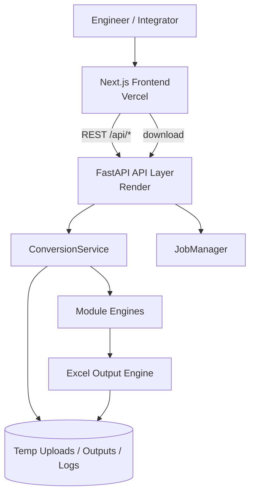
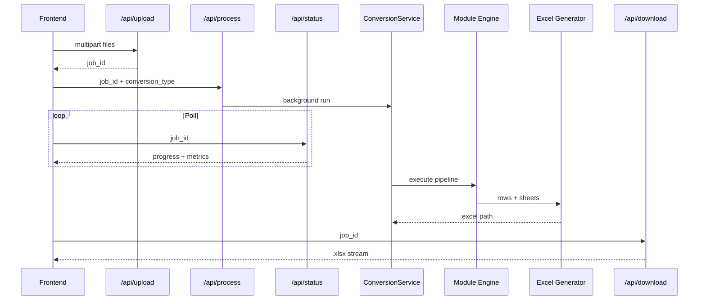

<p align="center">
  
</p>

<p align="center">
  
</p>

<h1 align="center">ABB AC450 Migration Studio</h1>

<p align="center"><strong>Enterprise Engineering Migration Platform</strong></p>

<p align="center">
  ABB AC450 Migration Studio is an enterprise-grade engineering conversion platform developed to automate the migration of ABB Advant Controller 450 engineering data into Valmet-compatible engineering deliverables.
</p>

<p align="center">
  
  
  
  
  
  
  
</p>

| Attribute | Value |
|-----------|-------|
| **Project** | ABB AC450 Migration Studio |
| **Version** | 1.0.0 |
| **Status** | Production-ready (v1) |
| **License** | Proprietary / project-defined (no public LICENSE file shipped) |
| **Author / Maintainer** | [vedantlanjekar-official](https://github.com/vedantlanjekar-official) |
| **Repository** | [ABB-AC450-Migration-Studio](https://github.com/vedantlanjekar-official/ABB-AC450-Migration-Studio) |
| **Frontend Deployment** | Vercel (Next.js App Router) |
| **Backend Deployment** | Render (`abb-ac450-migration-studio-backend`) |
| **Local Frontend** | http://localhost:5173 |
| **Local Backend** | http://127.0.0.1:8000 |
| **API Docs** | http://127.0.0.1:8000/docs |

---

## Table of Contents

1. [Project Overview](#1-project-overview)
2. [Features](#2-features)
3. [Complete System Workflow](#3-complete-system-workflow)
4. [Complete System Architecture](#4-complete-system-architecture)
5. [Technology Stack](#5-technology-stack)
6. [Project Structure](#6-project-structure)
7. [User Guide](#7-user-guide)
8. [Developer Guide](#8-developer-guide)
9. [Engineering Modules](#9-engineering-modules)
10. [Data Processing Pipeline](#10-data-processing-pipeline)
11. [API Documentation](#11-api-documentation)
12. [Frontend Architecture](#12-frontend-architecture)
13. [Backend Architecture](#13-backend-architecture)
14. [Deployment Guide](#14-deployment-guide)
15. [Performance](#15-performance)
16. [Security](#16-security)
17. [Engineering Design Decisions](#17-engineering-design-decisions)
18. [Future Scope](#18-future-scope)
19. [System Ratings](#19-system-ratings)
20. [Contributors](#20-contributors)
21. [Troubleshooting](#21-troubleshooting)
22. [Related Documentation](#22-related-documentation)
- [Appendix A — Engineering Glossary](#appendix-a--engineering-glossary)
- [Appendix B — Detailed API Examples](#appendix-b--detailed-api-examples)
- [Appendix C — PC Element Engineering Deep Dive](#appendix-c--pc-element-engineering-deep-dive)
- [Appendix D — DB Element Engineering Deep Dive](#appendix-d--db-element-engineering-deep-dive)
- [Appendix E — Comparator, Address, and Template Notes](#appendix-e--comparator-address-and-template-notes)
- [Appendix F — Frontend / Backend Contract Checklist](#appendix-f--frontend--backend-contract-checklist)
- [Appendix G — Local Smoke Test Script (Manual)](#appendix-g--local-smoke-test-script-manual)
- [Appendix H — Repository Hygiene](#appendix-h--repository-hygiene)
- [Appendix I — Frequently Asked Questions](#appendix-i--frequently-asked-questions)
- [Appendix J — Onboarding Guide for New Engineers](#appendix-j--onboarding-guide-for-new-engineers)
- [Appendix K — Non-Goals (Explicit)](#appendix-k--non-goals-explicit)
- [Appendix L — Change Impact Matrix](#appendix-l--change-impact-matrix)

---

## 1. Project Overview

### 1.1 What is ABB AC450 Migration Studio?

**ABB AC450 Migration Studio** is a full-stack industrial engineering application that converts legacy ABB Advant Controller 450 (AC450) / MasterPiece-style engineering dumps into structured Valmet DNA–ready Excel workbooks.

Control engineers historically receive AC450 configuration as multi-page PDF printouts (DB element listings and PC diagram sheets) or as intermediate Excel extracts. Manually re-keying tags, I/O addresses, descriptions, and card/channel allocations into Valmet engineering tools is slow, error-prone, and expensive on brownfield migration projects.

This platform automates that path end-to-end:

1. Upload PDF or Excel inputs through a guided web UI.
2. Select one of five engineering modules.
3. Run a backend conversion pipeline with live progress and logs.
4. Preview structured results in-browser.
5. Download Valmet-compatible `.xlsx` deliverables.

### 1.2 Why it was developed

ABB AC450 systems remain widely installed across pulp & paper, process industries, and discrete manufacturing sites. Migration programs to Valmet DNA require consistent translation of:

- Hardwired and 800-series I/O families (`AI`, `AO`, `DI`, `DO`, `AI800`, `AO800`, `DI800`, `DO800`)
- Loop Tags and Device Tags
- Card / channel addressing
- Clubbed input–output pairs for engineering import templates
- Cross-checks between source and target tag lists

The Studio was built to encode those engineering rules in software so project teams can scale migrations without depending solely on manual spreadsheet craftsmanship.

### 1.3 Engineering problem it solves

| Manual pain point | Platform response |
|-------------------|-------------------|
| Hundreds of PDF pages of DB dumps | Automated multi-layer PDF text extraction + grammar parsing |
| Inconsistent Device Tag transcription | Normalized tag parsing and attribute stripping |
| Missing default parameter values | `.DEFAULT` inheritance resolution (DB module) |
| AI/AO and DO/DI pairing mistakes | Deterministic Loop Tag clubbing engines |
| Unclear coverage of PC diagrams | Completeness audit + Function Block Summary sheet |
| Tag list reconciliation | Set-based Engineering Tag Comparator |
| Manual card channel packing | I/O Address Generator with hardware channel limits |
| Valmet import formatting | ABB Engineering Template Generator |

### 1.4 Target users

- **ABB / brownfield migration engineers** preparing Valmet cutovers
- **Valmet engineering teams** validating incoming tag structures
- **System integrators** delivering multi-site migration packages
- **Software developers** extending parsers and exporters
- **Project managers** needing auditable, repeatable conversion outputs

### 1.5 Business value

- Dramatic reduction in engineering hours for PDF-to-Excel conversion
- Consistent application of ABB addressing and Valmet column conventions
- Live validation metrics (counts, unmatched tags, completeness)
- Traceable job logs for project quality records
- Modular architecture allowing new converters without rewriting the UI shell

### 1.6 Industrial applications

Typical use cases include pulp & paper mill DCS upgrades, paper machine section migrations, water treatment brownfield replacements, and any AC450-to-Valmet DNA engineering data handover where PDF/Excel is the available source of truth.

### 1.7 Product positioning

ABB AC450 Migration Studio is intentionally positioned as an **engineering conversion workstation**, not as a replacement for ABB Control Builder, Valmet DNA engineering tools, or site DCS runtime systems. It sits in the **data preparation** layer of a migration program:

1. Source engineering artifacts are collected (PDF dumps, intermediate Excel extracts).
2. The Studio normalizes and reshapes those artifacts into Valmet-oriented workbooks.
3. Engineers review, adjust, and import the results into Valmet DNA engineering workflows.
4. Site acceptance testing remains a human-led process with the generated files as accelerators.

This positioning keeps responsibility boundaries clear: the software accelerates transcription and structuring; engineers remain accountable for process safety and final configuration correctness.

### 1.8 Typical project timeline impact

On a mid-size paper machine migration, teams often spend multiple engineer-weeks copying I/O references, verifying Loop Tag consistency, and rebuilding address sheets. With the Studio:

- Initial extract of DB/PC sources can be produced in a single working session.
- Comparator runs highlight tag gaps before FAT/SAT.
- Address and template generators reduce repetitive spreadsheet formatting.
- Function Block Summary gives project managers a fast view of control-block density in PC programs.

The net effect is earlier visibility of data quality issues and fewer late-stage spreadsheet reworks.

### 1.9 Quality philosophy

The parsers prioritize **deterministic engineering rules** over probabilistic guessing. Where text is ambiguous, the system prefers:

- Skipping unsupported object types rather than inventing Valmet rows
- Emitting warnings and completeness metrics rather than silent drops without audit
- Preserving source Device Tags (after normalization) instead of inventing new tag schemas

This philosophy makes outputs reviewable by ABB and Valmet engineers who already understand the underlying addressing conventions.

---

## 2. Features

### 2.1 Multi-module conversion suite

The application ships **five production modules**, selectable from the upload workspace:

| Module | Conversion type | Primary input | Primary output |
|--------|-----------------|---------------|----------------|
| DB Element Converter | `DB` | AC450 DB Element PDF | `Clubbed_IO` Excel |
| PC Element Converter | `PC` | AC450 PC Diagram PDF | `I_O_List` + `Function Block Summary` |
| Engineering Tag Comparator | `COMPARE` | Two Excel workbooks | `Summary` + `Unmatched Records` |
| I/O Address Generator | `IO_ARRANGE` | Clubbed/I_O Excel | Category sheets with packed addresses |
| ABB Engineering Template Generator | `ENG_TEMPLATE` | Clubbed/I_O Excel | `Engineering_Template` sheet |

### 2.2 Guided web workflow

- Module picker with clear engineering descriptions
- Drag-and-drop / multi-file upload
- Live progress phases with percentage and messages
- In-browser data-grid preview of generated sheets
- One-click Excel download
- Job log viewer for diagnostics

### 2.3 Hardwired I/O family focus

Across DB and PC parsers, the Studio focuses on the eight Valmet-critical families:

`AI`, `AO`, `DI`, `DO`, `AI800`, `AO800`, `DI800`, `DO800`

Unsupported object types such as `PIDCON`, `MOTCON`, `MANSTN`, `DAT`, `TEXT`, `AIC`, `AOC` are intentionally skipped by the I/O extractors (except PC Function Block Summary, which *counts* selected control-block declarations separately).

### 2.4 Loop Tag clubbing

Both DB and PC pipelines club records by Loop Tag with engineering section order:

- Analog clubs: **AI → AO**, **AI800 → AO800**
- Digital clubs: **DO → DI**, **DO800 → DI800**
- Valve-oriented ordering where applicable (for example `.SV1` / `.GSO` / `.GSC` patterns in DB mapping)

### 2.5 PC Function Block Summary

Independent of I/O extraction, PC Diagram text is scanned for ABB functional block **declarations** only:

- `PIDCON(...)`
- `MOTCON(...)`
- `VALVECON(...)`
- `MANSTN(...)`

Parameter references such as `=PIDCON1:94/940LC391:PARAM1` are ignored. Results are written to a dedicated **Function Block Summary** worksheet.

### 2.6 Completeness & comparison tooling

- PC completeness auditor for inventory vs extraction accuracy
- Excel tag comparator using case-insensitive Device Tag set logic
- Validation reports and job warnings surfaced in status payloads

### 2.7 Cloud-ready split deployment

- Frontend on **Vercel**
- Backend on **Render** with health checks and free-tier-friendly light PDF modes
- Local dual-process development via `start_dev.bat` or manual uvicorn / Next.js

### 2.8 Operational observability

Every conversion job exposes progress percentage, human-readable phase messages, category counts, generated sheet names, bounded preview rows, warning/error arrays, and downloadable plain-text logs. This observability is essential when engineering leads must explain why a Device Tag was included, excluded, or remapped.

### 2.9 Shared Excel design language

All generators reuse a common visual system in `backend/excel/design.py`: dark slate headers, Calibri typography, thin borders, zebra striping, centered indicator columns, and optional Valmet header post-processing (`$(TAG)`, `$(DEVICETAG)`, `$(NAME_40)`). Consistency across modules reduces training time for engineers consuming multiple deliverables.

### 2.10 Extensible function-block catalog

PC Function Block detection is catalog-driven. Adding a future block type is primarily an append to `SUPPORTED_FUNCTION_BLOCKS` plus regression tests, without touching I/O grammar. Control-block inventory and hardwired I/O extraction intentionally answer different engineering questions.

### 2.11 Windows-first local DX with cloud parity

`start_dev.bat` launches backend and frontend for Windows engineering laptops, while `vercel.json` and `render.yaml` preserve the same API contracts in cloud environments. Developers can reproduce production behavior locally by pointing `NEXT_PUBLIC_API_URL` at either local Uvicorn or the Render service.

---

## 3. Complete System Workflow

### 3.1 End-to-end flow (all modules)

```text
Select Engineering Module
        │
        ▼
Upload Source Files (PDF / Excel)
        │
        ▼
POST /api/upload  →  job_id
        │
        ▼
POST /api/process { job_id, conversion_type }
        │
        ▼
ConversionService routes to module pipeline
        │
        ▼
Extract / Parse / Validate / Club / Format
        │
        ▼
Generate Excel workbook (openpyxl)
        │
        ▼
Poll GET /api/status/{job_id}
        │
        ▼
Preview results in UI
        │
        ▼
GET /api/download/{job_id}  →  .xlsx deliverable
```

### 3.2 DB Element workflow stages

```text
PDF Upload
  → Multi-layer PDF text extraction
  → Document cleaning / header-footer filtering
  → Object & family detection (AI/AO/DI/DO + 800)
  → Parameter extraction (:KEY VALUE)
  → DEFAULT profile detection & inheritance merge
  → Loop Tag derivation & record clubbing
  → Category indicator mapping
  → Clubbed_IO Excel export
```

### 3.3 PC Element workflow stages

```text
PC Diagram PDF Upload
  → Multi-layer PDF read (PyMuPDF / pdfplumber)
  → Page cleaning
  → I/O candidate detection
  → Grammar parse (Category, Card, Channel, Device/Loop Tag)
  → Description mapping
  → Metadata extraction
  → Deduplicate & validate
  → Completeness audit
  → Club & format
  → Function Block declaration counting (parallel concern)
  → Excel: I_O_List + Function Block Summary
```

### 3.4 Stage explanations

| Stage | Responsibility |
|-------|----------------|
| **Upload** | Persist files under job-scoped temp directories; return `job_id` |
| **Process** | Start background worker; set conversion type |
| **Extract** | Recover selectable text from PDF/Excel with maximum recall |
| **Parse** | Apply ABB grammar / Excel column mapping |
| **Clean** | Strip noise, normalize tags, remove duplicates |
| **Club** | Pair related I/O by Loop Tag in engineering order |
| **Validate** | Accept supported families; emit warnings for gaps |
| **Generate** | Style workbook with shared Excel design system |
| **Download** | Stream completed `.xlsx` to the client |

### 3.5 Cross-module sequencing on real projects

A recommended project sequence used by migration teams:

1. **DB Element Converter** on database dumps → establish Loop Tag / Device Tag baseline.
2. **PC Element Converter** on logic drawings → capture hardwired references + function-block density.
3. **Engineering Tag Comparator** between DB-derived and PC-derived (or site) Excel lists → find gaps.
4. **I/O Address Generator** on cleaned clubbed lists → produce card packing sheets for hardware planning.
5. **ABB Engineering Template Generator** → create import-oriented paired templates for Valmet engineering.

This sequence is not enforced by the software (modules are independently selectable), but it mirrors how engineering work packages usually unfold.

### 3.6 Failure and retry workflow

If a job fails:

1. Open the log modal / `GET /api/logs/{job_id}`.
2. Identify the failing stage (PDF read, grammar, Excel write, etc.).
3. Correct the source artifact or environment (for example, textless scanned PDF).
4. Re-upload and re-process (new job id). Jobs are not mutated in place after terminal failure in the normal UI flow.

---

## 4. Complete System Architecture

### 4.1 High-level architecture



### 4.2 Layered component model

```text
Frontend (Next.js + Zustand + React Query)
        │
        ▼
API Layer (upload / process / status / download / logs / health)
        │
        ▼
Backend Services (ConversionService + JobManager)
        │
        ▼
Extraction Engines (PDF / Excel readers)
        │
        ▼
Conversion Engines (DB / PC / Compare / Arrange / Template)
        │
        ▼
Output Engine (openpyxl workbook builders + shared design)
        │
        ▼
Download Service (authenticated-by-job-id file response)
```

### 4.3 Component responsibilities

| Component | Responsibility |
|-----------|----------------|
| **Frontend** | Module selection, upload UX, polling, preview, download |
| **API Layer** | HTTP contracts, validation, CORS, job orchestration triggers |
| **JobManager** | In-memory job state, progress, metrics, preview payloads |
| **ConversionService** | Routes `conversion_type` to the correct pipeline |
| **Extraction Engine** | PDF text layers, Excel sheet readers |
| **Conversion Engine** | Domain rules per module |
| **Output Engine** | Sheet creation, styling, header post-processing |
| **Download Service** | Serves generated workbook for a completed job |

### 4.4 Runtime topology

| Environment | Frontend | Backend |
|-------------|----------|---------|
| Local | Next.js `:5173` | Uvicorn `:8000` |
| Production | Vercel | Render web service |

Communication uses `NEXT_PUBLIC_API_URL` (production Render URL or local `http://127.0.0.1:8000/api`).

---

## 5. Technology Stack

| Layer | Technology | Role |
|-------|------------|------|
| **Frontend framework** | Next.js 15 (App Router) | UI shell, SSR/static delivery |
| **UI library** | React 18 | Component model |
| **Styling** | Tailwind CSS 3 | Utility styling |
| **Motion** | Framer Motion | Landing / workflow transitions |
| **Icons** | Lucide React | UI iconography |
| **Client state** | Zustand | Pipeline stage + job store |
| **Server state / polling** | TanStack React Query | Status query patterns |
| **HTTP client** | Axios | API calls |
| **Language (FE)** | TypeScript | Typed frontend |
| **Backend framework** | FastAPI | REST API |
| **ASGI server** | Uvicorn | Process hosting |
| **Validation** | Pydantic v2 / pydantic-settings | Schemas & config |
| **PDF processing** | pdfplumber, PyMuPDF (fitz) | Text & spatial extraction |
| **Excel processing** | openpyxl, XlsxWriter, pandas | Workbook I/O |
| **Multipart uploads** | python-multipart | File intake |
| **HTTP utils** | requests | Auxiliary HTTP |
| **Language (BE)** | Python 3.11+ (local 3.12 supported) | Backend runtime |
| **Frontend hosting** | Vercel | CDN + Next.js deployment |
| **Backend hosting** | Render | Persistent Python web service |
| **SCM** | GitHub | Source of truth |
| **Local launcher** | `start_dev.bat` | Windows dual-service start |

> Note: The UI is **Next.js**, not Vite. Older documentation mentioning Vite should be treated as outdated.

---

## 6. Project Structure

```text
ABB-AC450-Migration-Studio/
├── frontend/                      # Next.js application
│   ├── app/                       # App Router pages & layout
│   ├── components/                # Dropzone, results, processing, header
│   ├── hooks/                     # Upload, polling, job orchestration
│   ├── services/                  # Axios API client
│   ├── store/                     # Zustand converter store
│   ├── types/                     # ConversionType & status types
│   ├── utils/                     # Formatters
│   ├── public/                    # Logos & hero assets
│   └── package.json
├── backend/
│   ├── main.py                    # FastAPI entrypoint
│   ├── api/                       # upload, process, status, download, logs
│   ├── services/                  # ConversionService, JobManager
│   ├── core/                      # Settings & logging
│   ├── schemas/                   # Pydantic API models
│   ├── constants/                 # AC450 constants / families
│   ├── parser/                    # DB Element PDF parser stack
│   ├── extractor/                 # Parameter extractor
│   ├── mapper/                    # Clubbing, category mapping, formatting
│   ├── excel/                     # Shared workbook design & generators
│   ├── pc_element/parser/         # Production PC Element engine
│   ├── pc_parser/                 # Legacy PC stack (not primary path)
│   ├── excel_compare/             # Tag comparator
│   ├── io_address_arrangement/    # Address packing module
│   ├── engineering_template/      # Valmet template generator
│   ├── models/                    # Domain models
│   ├── utils/                     # Filename helpers
│   └── tests/                     # pytest suite
├── api/                           # Deprecated Vercel serverless stub
├── docs/                          # Architecture & module docs
├── examples/                      # Sample generators
├── requirements.txt               # Python dependencies
├── package.json                   # Root build helper for Vercel
├── vercel.json                    # Frontend deploy config
├── render.yaml                    # Backend deploy config
├── start_dev.bat                  # Local dual-service launcher
└── README.md                      # This document
```

### Folder responsibilities

| Path | Responsibility |
|------|----------------|
| `frontend/` | All user-facing UI and client orchestration |
| `backend/api/` | Thin HTTP adapters around services |
| `backend/services/` | Business orchestration and job lifecycle |
| `backend/parser/` | DB PDF grammar, inheritance, object detection |
| `backend/pc_element/` | Current PC Diagram hardwired I/O + FB summary |
| `backend/excel_compare/` | Device Tag set comparison |
| `backend/io_address_arrangement/` | Hardware-aware address sheet layout |
| `backend/engineering_template/` | Import template mapping |
| `backend/excel/` | Shared styling / header post-processing |
| `docs/` | Deep-dive design notes beyond this README |
| Temp dirs (`UPLOAD_DIR`, `OUTPUT_DIR`, `LOG_DIR`) | Runtime job artifacts under system temp |

---

## 7. User Guide

### 7.1 Prerequisites for end users

- Modern browser (Google Chrome recommended)
- Access to the deployed site **or** a locally running stack
- Source files:
  - DB/PC modules → PDF
  - Comparator / Address / Template modules → Excel (`.xlsx` / `.xlsm` / `.xls` as accepted by upload API)

### 7.2 How to use the application

1. Open the Migration Studio landing page.
2. Review the feature cards / workflow strip to confirm you are on the correct tool.
3. In the upload workspace, select the engineering module:
   - **DB Element Converter**
   - **PC Element Converter**
   - **Engineering Tag Comparator**
   - **I/O Address Generator**
   - **ABB Engineering Template Generator**
4. Upload the required file(s). Comparator typically expects two workbooks.
5. Start processing and wait for the progress view to complete.
6. Inspect preview grids and metrics on the results screen.
7. Download the generated Excel package.
8. Optionally open job logs if warnings/errors appear.

### 7.3 Module-specific user notes

**DB Element Converter**  
Upload an AC450 DB Element PDF. Output is a Valmet-style clubbed I/O sheet with category indicators.

**PC Element Converter**  
Upload a PC Diagram PDF. Output includes hardwired I/O list plus Function Block Summary counts for `PIDCON` / `MOTCON` / `VALVECON` / `MANSTN` declarations.

**Engineering Tag Comparator**  
Upload two Excel files representing tag inventories. Review matched vs unmatched Device Tags.

**I/O Address Generator**  
Upload a previously generated Clubbed/I_O workbook. Receive packed address sheets by category with ABB channel limits applied.

**ABB Engineering Template Generator**  
Upload Clubbed/I_O Excel. Receive a Valmet engineering import template with paired card types and device tags.

### 7.4 Screenshots

> Placeholders for project screenshots (replace with captured UI images when publishing):

| Screen | Placeholder |
|--------|-------------|
| Landing / hero | `` |
| Module selection & upload | `` |
| Processing progress | `` |
| Results & preview grid | `` |
| Downloaded Excel (PC) | `` |

Existing brand assets available in-repo:

- `frontend/public/valmet-logo.webp`
- `frontend/public/valmet-logo-bg.png`
- `frontend/public/hero-page.png`

---

## 8. Developer Guide

### 8.1 Local development quick start

```bash
# From repository root
python -m venv venv
# Windows
.\venv\Scripts\Activate.ps1
# macOS/Linux
source venv/bin/activate

pip install -r requirements.txt

# Terminal A — backend
python -m uvicorn backend.main:app --reload --host 127.0.0.1 --port 8000

# Terminal B — frontend
cd frontend
cp .env.example .env.local
# set NEXT_PUBLIC_API_URL=http://127.0.0.1:8000/api
npm install
npm run dev
```

Windows convenience launcher:

```bat
start_dev.bat
```

Open http://localhost:5173 and confirm http://127.0.0.1:8000/api/health returns `status: online`.

### 8.2 Environment variables

| Variable | Side | Purpose | Example |
|----------|------|---------|---------|
| `NEXT_PUBLIC_API_URL` | Frontend | API base URL | `http://127.0.0.1:8000/api` |
| `PROJECT_NAME` | Backend | Service title | `ABB AC450 Migration Studio` |
| `VERSION` | Backend | Version string | `1.0.0` |
| `API_PREFIX` | Backend | Router prefix | `/api` |
| `PORT` | Backend | Bind port (Render injects) | `8000` |
| `PC_LIGHT_PDF_READ` | Backend | Prefer lightweight PC PDF path | `1` |
| `DB_LIGHT_PDF_READ` | Backend | Prefer lightweight DB PDF path | `1` |
| `ENABLE_PC_OCR` | Backend | Optional OCR enrichment | `0` |
| `MAX_UPLOAD_SIZE_MB` | Backend | Upload ceiling | `100` |
| `PYTHON_VERSION` | Render | Runtime pin | `3.11.0` |

### 8.3 Development workflow

1. Create a feature branch from `main`.
2. Implement parser/service changes under the relevant backend package.
3. Add or update pytest coverage in `backend/tests/`.
4. Keep UI changes typed (`frontend/types`, store, API client).
5. Run local dual-service smoke test (upload → process → download).
6. Open PR with engineering rationale and sample outputs when possible.

### 8.4 How to add a new module

1. Define a new `conversion_type` string and frontend `ConversionType` union member.
2. Add a dropzone option label/description.
3. Implement an engine package under `backend/<module>/`.
4. Wire a branch in `ConversionService.run_conversion_pipeline`.
5. Emit `generated_sheets`, `preview_data`, and an Excel path consistently.
6. Document engineering rules in `docs/` and this README.

### 8.5 Coding standards

- Prefer isolated module packages; do not couple PC grammar into DB inheritance code.
- Keep HTTP handlers thin; put logic in services/engines.
- Preserve existing Excel sheet contracts unless a versioned migration is planned.
- Use shared `backend/excel/design.py` for visual consistency.
- Log stage markers for long-running PDF jobs.
- Avoid committing secrets; keep `.env*` local (already gitignored).

### 8.6 Error handling & logging

- Job status transitions to `failed` with `errors[]` on pipeline exceptions.
- Heartbeats refresh `updated_at` so clients can detect stalled workers.
- `GET /api/logs/{job_id}` returns plain-text operational logs.
- Health endpoint probes filesystem writability for uploads/outputs/logs.

### 8.7 Testing

```bash
pytest backend/tests -q
```

Critical suites include DB/PC parsers, record clubbing, Excel generators, comparator, address arrangement, engineering template, and API smoke tests.

---

## 9. Engineering Modules

## Module 1 — DB Element Converter

### Purpose

Extract supported I/O element instances from ABB AC450 **DB Element** PDF dumps, resolve default-parameter inheritance, club related tags, and export a Valmet-ready `Clubbed_IO` workbook.

### Input

- One or more DB Element PDF files

### Processing highlights

- Multi-strategy PDF text extraction
- Family detection limited to eight I/O types
- Parameter parsing (`:KEY VALUE`)
- `.DEFAULT` / hardware-software default merge
- Loop Tag derivation from Device Tag (strip final `.EXTENSION`)
- Record clubbing and section sequencing
- Category indicator columns (`AI`…`DO800_`) populated with `1` when matched

### Output

| Sheet | Contents |
|-------|----------|
| `Clubbed_IO` | Clubbed engineering I/O rows with Valmet-oriented headers |

### Engineering rules

- Ignore non-I/O object types in the DB dump for this converter
- Preserve overrides over inherited defaults
- Club AI with AO (and 800 equivalents) under the same Loop Tag
- Club DO ahead of DI (and 800 equivalents) under the same Loop Tag

### Validation

- Unsupported categories rejected/skipped
- Duplicate collapse according to mapper rules
- Status metrics expose AI/AO/DI/DO counts, duplicates, missing descriptions, inheritance stats

### Key paths

- `backend/parser/*`
- `backend/extractor/parameter_extractor.py`
- `backend/mapper/*`
- `backend/excel/*`

---

## Module 2 — PC Element Converter

### Purpose

Parse ABB **PC Diagram** PDFs for hardwired I/O address references and produce a Valmet `I_O_List`, plus an independent **Function Block Summary**.

### Input

- PC Diagram PDF (function-block / hardwired drawings)

### Complete pipeline

1. `PDFReader` — multi-layer text (light mode uses PyMuPDF primary)
2. `PageCleaner` — strip title-block / copyright noise
3. `IOReferenceDetector` — candidate scan (regex + spatial tokens)
4. `GrammarParser` — Category, Card, Channel, Device Tag, Loop Tag
5. `DescriptionMapper` — nearby description when present
6. `MetadataExtractor` — controller / process area
7. `DuplicateDetector` — collapse exact/attribute variants
8. `Validator` — keep supported eight families
9. `CompletenessAuditor` — inventory vs extraction report
10. `RecordClubber` + `OutputFormatter` — club & order
11. `FunctionBlockExtractor` — declaration counts (independent)
12. `ExcelGenerator` — `I_O_List` + `Function Block Summary`

### Device Tag & Loop Tag logic

Typical address patterns:

```text
Standard:   [=|-|P-=]* PREFIX CARD . CHANNEL / DEVICE_TAG
Port-style: [=|-|P-=]* PREFIX CARD : PORT    / DEVICE_TAG[:ATTR]
No-channel: [=|-|P-=]* PREFIX CARD           / DEVICE_TAG
800-series: PREFIX800_ CARD . CHANNEL / DEVICE_TAG
```

- Device Tag is the token after `/`
- Colon attributes (`KEY:SELECTED`) are stripped for Device Tag normalization
- Loop Tag is Device Tag without the final `.EXTENSION`

### Supported I/O families

`AI`, `AO`, `DI`, `DO`, `AI800`, `AO800`, `DI800`, `DO800`

### Function Block Summary

| Functional Block | Detection |
|------------------|-----------|
| PIDCON | `PIDCON(` declaration only |
| MOTCON | `MOTCON(` declaration only |
| VALVECON | `VALVECON(` declaration only |
| MANSTN | `MANSTN(` declaration only |

**Counted:** `PIDCON(0,0,1,1,1,0)`  
**Not counted:** `=PIDCON1:94/940LC391:PARAM1`, `PIDCON1:55/...`

Implementation: `backend/pc_element/parser/function_block_extractor.py`  
Extensibility: append to `SUPPORTED_FUNCTION_BLOCKS`.

### Output sheets

| Sheet | Columns (summary) |
|-------|-------------------|
| `I_O_List` | Sr. No., Loop Tag, Description, Device Tag, AI/AO/DI/DO/AI800_/AO800_/DI800_/DO800_, Slot/Card, Channel |
| `Function Block Summary` | Functional Block, Total Count |

### Key paths

- `backend/pc_element/parser/*`
- `docs/pc_element_module.md`

---

## Module 3 — Engineering Tag Comparator

### Purpose

Compare Device Tag inventories across two Excel workbooks to identify matches and gaps during migration validation.

### Matching algorithm

- Extract `$(DEVICETAG)` (or equivalent Device Tag columns) from each workbook
- Normalize case for set comparison
- Deduplicate within each source file
- Compute intersection and asymmetric differences

### Comparison engine outputs

| Sheet | Meaning |
|-------|---------|
| `Summary` | Aggregate matched / unmatched metrics |
| `Unmatched Records` | Tags present in only one worksheet/file |

### Validation

- Reports worksheet record counts, matched count, unmatched count
- Preview data available through status API for UI grids

### Key paths

- `backend/excel_compare/comparator.py`
- `backend/excel_compare/column_extractor.py`
- `backend/excel_compare/report_generator.py`

---

## Module 4 — I/O Address Generator

### Purpose

Re-pack Device Tags from an existing Clubbed/I_O workbook into category worksheets that reflect ABB hardware channel capacities and Valmet address presentation conventions.

### Card allocation & hardware limits

| Family | Channels per card (engine rule) |
|--------|----------------------------------|
| AI / AO | 16 |
| AI800_ / AO800_ | 8 |
| DI / DO / DI800_ / DO800_ | 32 |

### Address generation behavior

- Reads Device Tag plus Category or indicator columns
- Creates one sheet per populated category
- Layout uses repeating tag/device columns with separators
- Tags themselves are not rewritten; allocation is organizational

### Output

Dynamic sheets named among: `AI`, `AO`, `DI`, `DO`, `AI800_`, `AO800_`, `DI800_`, `DO800_` (only categories with records).

### Key paths

- `backend/io_address_arrangement/arranger.py`

---

## Module 5 — ABB Engineering Template Generator

### Purpose

Transform clubbed I/O rows into a Valmet-oriented **Engineering Template** used for structured import workflows.

### Template mapping concepts

- Prefer source sheets `Clubbed_IO` or `I_O_List`
- Pair adjacent compatible categories sharing Loop Tag:
  - AI–AO, DO–DI, AI800_–AO800_, DO800_–DI800_
- Map into placeholders such as `$(PACKAGE)`, `$(TAG)`, `$(CARDTYPE1/2)`, `$(DEVICETAG1/2)`, range/unit fields

### Output

| Sheet | Role |
|-------|------|
| `Engineering_Template` | Import-ready paired engineering rows |

### Key paths

- `backend/engineering_template/generator.py`

---

## 10. Data Processing Pipeline

### 10.1 Unified orchestration view



### 10.2 DB pipeline detail

Text extract → clean → detect families → parse objects → extract parameters → resolve defaults → map categories → club → format → Excel.

### 10.3 PC pipeline detail

Text extract → clean → detect I/O candidates → grammar parse → descriptions/metadata → dedupe/validate → completeness audit → club/format → function-block counts → multi-sheet Excel.

### 10.4 Excel-native modules

Comparator / Address / Template skip PDF extraction and operate on workbook structures, then emit specialized sheets through the same job/download lifecycle.

---

## 11. API Documentation

Base URL (local): `http://127.0.0.1:8000`  
API prefix: `/api`  
Interactive docs: `/docs` (Swagger UI)

### 11.1 Health

| Item | Detail |
|------|--------|
| **Methods / Paths** | `GET /health`, `GET /api/health` |
| **Purpose** | Liveness + filesystem writability probe |
| **Success response** | `{ "status": "online", "project": "...", "version": "1.0.0", "filesystem": { ... } }` |
| **Degraded** | `status: "degraded"` when temp dirs are not writable |

### 11.2 Upload

| Item | Detail |
|------|--------|
| **Method / Path** | `POST /api/upload` |
| **Body** | `multipart/form-data` file fields |
| **Success (200)** | `FileUploadResponse` |

```json
{
  "job_id": "uuid-or-job-id",
  "uploaded_files": ["diagram.pdf"],
  "total_files": 1,
  "message": "Upload successful"
}
```

| Status | Meaning |
|--------|---------|
| 200 | Files stored for job |
| 4xx | Validation / empty upload / unsupported payload |
| 5xx | Storage or server failure |

### 11.3 Process

| Item | Detail |
|------|--------|
| **Method / Path** | `POST /api/process` |
| **Body (JSON)** | `{ "job_id": "...", "conversion_type": "DB|PC|COMPARE|IO_ARRANGE|ENG_TEMPLATE" }` |

```json
{
  "job_id": "abc123",
  "conversion_type": "PC"
}
```

Starts background conversion. Clients should poll status.

### 11.4 Status

| Item | Detail |
|------|--------|
| **Method / Path** | `GET /api/status/{job_id}` |
| **Purpose** | Progress, metrics, preview, sheet names, errors |

Key fields include `status`, `progress_percentage`, `current_phase`, `message`, `conversion_type`, category counts, comparator metrics, `generated_sheets`, `preview_data`, `warnings`, `errors`, `excel_file_path`, `updated_at`.

Typical `status` values used by the UI: `idle`, `reading_pdf`, `extracting_text`, `detecting_elements`, `grouping_elements`, `generating_excel`, `completed`, `failed`.

### 11.5 Download

| Item | Detail |
|------|--------|
| **Method / Path** | `GET /api/download/{job_id}` |
| **Success** | Excel file download (`application/vnd.openxmlformats-officedocument.spreadsheetml.sheet`) |
| **Errors** | 404 if job missing / not complete / file absent |

### 11.6 Logs

| Item | Detail |
|------|--------|
| **Method / Path** | `GET /api/logs/{job_id}` |
| **Success** | Plain-text job log body |
| **Use** | Debugging extraction stages and failures |

### 11.7 Error response conventions

- Transport failures and validation errors return FastAPI/HTTPException payloads.
- Pipeline soft failures populate `errors` / `warnings` on the status object while keeping the HTTP status endpoint reachable.
- Stale jobs may be marked failed by status polling logic when heartbeats stop.

---

## 12. Frontend Architecture

### 12.1 App structure

| Path | Role |
|------|------|
| `frontend/app/page.tsx` | Renders landing/workflow shell |
| `frontend/app/layout.tsx` | Global chrome, fonts, metadata, favicon |
| `frontend/app/providers.tsx` | React Query provider + log modal host |
| `frontend/app/globals.css` | Global styles |

### 12.2 Key components

| Component | Responsibility |
|-----------|----------------|
| `framer_landing.tsx` | Primary page composition |
| `dropzone.tsx` | Module selection + file intake |
| `processing_view.tsx` | Progress visualization |
| `results_view.tsx` | Metrics, download, completion messaging |
| `data_grid_preview.tsx` | Tabular preview of sheet rows |
| `workflow_cards.tsx` | Pipeline step presentation |
| `feature_cards.tsx` | Marketing/feature highlights |
| `header.tsx` | Branding header |
| `log_modal.tsx` | Job log viewer |

### 12.3 State management

- **Zustand store** (`converter_store.ts`): stage (`upload` / `processing` / `results`), selected conversion type, files, job id, status payload, logs.
- **React Query**: shared query client for async patterns.
- **Hooks**: `use_file_upload`, `use_status_polling`, `use_converter_job` orchestrate the job lifecycle.

### 12.4 Routing & UI workflow

Single-page App Router experience with stage-driven views rather than multi-route navigation. Users move linearly:

`upload → processing → results`

API base resolution prefers `NEXT_PUBLIC_API_URL`, falling back to local `http://127.0.0.1:8000/api` in development.

---

## 13. Backend Architecture

### 13.1 Entrypoint

`backend/main.py` constructs the FastAPI app, enables CORS, mounts routers under `/api`, and exposes health probes.

### 13.2 Routes

| Router file | Endpoints |
|-------------|-----------|
| `api/upload.py` | `POST /upload` |
| `api/process.py` | `POST /process` |
| `api/status.py` | `GET /status/{job_id}` |
| `api/download.py` | `GET /download/{job_id}` |
| `api/logs.py` | `GET /logs/{job_id}` |

### 13.3 Services

- **ConversionService** — selects and executes module pipelines; updates job metrics and sheet lists.
- **JobManager** — in-memory job registry and status transitions.
- **pipeline_executor** — helper execution/heartbeat patterns for long jobs.

### 13.4 Processing engines

| Engine | Package |
|--------|---------|
| DB PDF parser | `backend/parser` |
| PC Element parser | `backend/pc_element/parser` |
| Excel compare | `backend/excel_compare` |
| I/O address arrange | `backend/io_address_arrangement` |
| Engineering template | `backend/engineering_template` |

### 13.5 Utilities & shared Excel

- `backend/utils/file_utils.py` — sanitize names, unique output paths
- `backend/excel/design.py` — shared workbook styling
- `backend/excel/header_postprocessor.py` — Valmet header renames (`$(TAG)`, `$(DEVICETAG)`, …)
- `backend/core/config.py` — settings from environment
- `backend/core/logging.py` — structured logger access

### 13.6 Validation philosophy

Validators are family-aware and conservative: unsupported engineering object types are skipped for I/O export rather than forcing incorrect Valmet rows. PC completeness auditing quantifies misses without mutating the I/O grammar.

---

## 14. Deployment Guide

### 14.1 Local development

See [Developer Guide](#8-developer-guide). Recommended smoke checklist:

1. `/api/health` online
2. Frontend loads module picker
3. Upload sample PDF/Excel
4. Process completes
5. Download opens in Excel

### 14.2 GitHub

Canonical repository:

https://github.com/vedantlanjekar-official/ABB-AC450-Migration-Studio

`render.yaml` is configured for `branch: main` with `autoDeploy: true`.

### 14.3 Vercel (frontend)

Configured by `vercel.json`:

- Install: `cd frontend && npm install`
- Build: `cd frontend && npm run build`
- Output: `frontend/.next`

Set `NEXT_PUBLIC_API_URL` to the Render backend API base, for example:

```text
https://abb-ac450-migration-studio-backend.onrender.com/api
```

### 14.4 Render (backend)

Configured by `render.yaml`:

- Service name: `abb-ac450-migration-studio-backend`
- Build: `pip install -r requirements.txt`
- Start: `uvicorn backend.main:app --host 0.0.0.0 --port $PORT --workers 1`
- Health check: `/health`
- Region: Oregon
- Env: `PYTHON_VERSION=3.11.0`, light PDF flags, OCR disabled by default

### 14.5 Production architecture

```text
Users
  → Vercel (Next.js UI)
      → Render FastAPI (/api/*)
          → Temp filesystem (uploads/outputs/logs)
          → Generated .xlsx download
```

### 14.6 Production notes

- Free-tier Render instances may cold-start; health/warmup monitors are recommended.
- Keep `PC_LIGHT_PDF_READ=1` / `DB_LIGHT_PDF_READ=1` on memory-constrained hosts.
- `api/index.py` is a deprecated Vercel serverless path; production backend is Render.

---

## 15. Performance

| Dimension | Guidance (v1) |
|-----------|----------------|
| **Processing speed** | Small PC/DB PDFs often complete in seconds to low minutes depending on page count and host CPU |
| **Large drawings** | Multi-dozen page PC diagrams are dominated by PDF text fusion and candidate scanning |
| **Memory usage** | Light PDF modes reduce dual-engine peaks; pandas/openpyxl add transient workbook memory |
| **Concurrency** | Single Uvicorn worker in Render config; in-memory JobManager is process-local |
| **Scalability** | Horizontal scale requires shared job store + shared object storage (future) |
| **Reliability** | Stage logging, heartbeats, completeness reports, and explicit failed states |

Practical tip: for big PC PDFs, prefer hosts with ≥1 GB RAM and keep OCR off unless selectable text density is poor.

---

## 16. Security

| Control | Implementation |
|---------|----------------|
| **File validation** | Upload path accepts expected document types; size governed by `MAX_UPLOAD_SIZE_MB` |
| **Input validation** | Pydantic request models for process payloads |
| **Temporary storage** | Job files under system temp namespaces, not committed to git |
| **CORS** | Enabled for browser clients (open origins in current config — tighten for hardened enterprise installs) |
| **Safe Excel writes** | Cell sanitization avoids formula injection from strings beginning with `=`, `+`, `@`, etc. |
| **Error handling** | Exceptions logged server-side; client receives structured errors/warnings |
| **Secrets** | Environment-based configuration; `.env*` gitignored |
| **AuthN/AuthZ** | Not bundled in v1 (job IDs act as capability tokens) — add SSO/API keys for multi-tenant production |

---

## 17. Engineering Design Decisions

| Decision | Rationale |
|----------|-----------|
| **FastAPI** | Fast Python API, native async, excellent OpenAPI docs for engineering stakeholders |
| **Next.js App Router** | Production React hosting, simple Vercel deployment, single-page workflow shell |
| **Zustand + React Query** | Lightweight UI state for stages; polling-friendly server state |
| **Modular backend packages** | Each engineering module can evolve without breaking others |
| **openpyxl** | Fine-grained multi-sheet styling and header control for Valmet layouts |
| **pdfplumber + PyMuPDF** | Complementary PDF text recall on CAD/vector drawings |
| **Declaration-only FB detection** | Prevents false positives from dense PC cross-reference labels |
| **In-memory JobManager** | Simple operational model for single-worker deployments |
| **Vercel + Render split** | Matches free/low-cost hosting strengths of FE vs long-running Python jobs |
| **Shared Excel design system** | Visual consistency across DB/PC/compare/template outputs |

---

## 18. Future Scope

| Theme | Candidates |
|-------|------------|
| **OCR / AI assist** | Stronger recovery for scanned-only diagrams; selective ENABLE flags already exist |
| **Machine learning** | Description association, noisy-label cleanup, block-type classification |
| **Additional ABB platforms** | Broader AC family coverage beyond AC450-focused rules |
| **Other DCS vendors** | DeltaV, Honeywell, Yokogawa mapping packs |
| **Batch conversion** | Multi-PDF project queues with consolidated reporting |
| **Cloud processing** | Object storage, Redis job bus, horizontal workers |
| **Security hardening** | Auth, signed URLs, stricter CORS, retention policies |
| **Localization** | Multi-language UI for global engineering centers |
| **Deeper Valmet integration** | Direct import adapters beyond Excel intermediaries |
| **Richer Function Block analytics** | Expand beyond PIDCON/MOTCON/VALVECON/MANSTN |

---

## 19. System Ratings

Professional evaluation of the current v1.0.0 codebase as an enterprise migration accelerator (not a certified DCS product).

| Module / Area | Rating | Comments |
|---------------|-------:|----------|
| DB Element Converter | **8.5 / 10** | Strong inheritance + clubbing; deep parser surface area |
| PC Element Converter | **8.7 / 10** | Production grammar, completeness audit, FB summary addition |
| Engineering Tag Comparator | **8.0 / 10** | Clear set-based Device Tag reconciliation |
| I/O Address Generator | **8.0 / 10** | Hardware channel rules encoded; category sheet outputs |
| ABB Engineering Template Generator | **8.2 / 10** | Practical Valmet placeholder mapping |
| Frontend | **8.3 / 10** | Cohesive workflow UX; single-page clarity |
| Backend | **8.6 / 10** | Clean FastAPI modularization |
| API | **8.5 / 10** | Consistent job lifecycle endpoints + OpenAPI |
| UI/UX | **8.0 / 10** | Professional industrial aesthetic; screenshot pack still optional |
| Overall Architecture | **8.6 / 10** | Module isolation is a major strength |
| Code Maintainability | **8.2 / 10** | Good package boundaries; dual PC stacks need discipline |
| Deployment Readiness | **8.0 / 10** | Vercel/Render ready; free-tier cold starts & no auth in v1 |

### Overall project rating

## **8.4 / 10 — Production-capable engineering tool**

### Strengths

- Five complementary modules covering extract → compare → arrange → template
- Engineering rules encoded explicitly (families, clubbing, channel limits, FB declarations)
- Clear API job model with preview and logs
- Documented PC module and shared Excel design language

### Weaknesses

- No first-class authentication/authorization
- In-memory jobs do not survive multi-instance scale-out
- Legacy `pc_parser` coexists with `pc_element` (cognitive overhead)
- OCR path is optional and environment-sensitive

### Areas of improvement

- Persist jobs and artifacts in shared storage
- Add enterprise auth and audit trails
- Expand automated golden-file PDF fixtures
- Publish screenshot gallery and sample datasets
- Collapse/retire legacy PC stack after verification

### Production readiness

Suitable for **controlled enterprise use** by engineering teams that understand AC450/Valmet conventions, with recommended hosting hardening before broad multi-tenant exposure.

---

## 20. Contributors

| Role | Details |
|------|---------|
| **Author / Primary maintainer** | [vedantlanjekar-official](https://github.com/vedantlanjekar-official) |
| **Repository** | [ABB-AC450-Migration-Studio](https://github.com/vedantlanjekar-official/ABB-AC450-Migration-Studio) |
| **Contact** | Via GitHub issues / repository owner profile |
| **Copyright notice (UI)** | © 2026 ABB AC450 Migration Studio |

### Version history

| Version | Highlights |
|---------|------------|
| **1.0.0** | DB + PC converters, comparator, I/O address generator, engineering template generator, Vercel/Render deployment topology, PC Function Block Summary worksheet |

Contributions should follow the Developer Guide: typed API contracts, module isolation, tests, and engineering-rule documentation.

---

## 21. Troubleshooting

| Symptom | Likely cause | Action |
|---------|--------------|--------|
| Frontend loads but processing fails | Backend down or wrong `NEXT_PUBLIC_API_URL` | Check `/api/health`; fix `.env.local` |
| Upload rejected | File type/size | Use supported PDF/Excel; check `MAX_UPLOAD_SIZE_MB` |
| Empty PC I/O list | Scanned PDF / low text density | Enable OCR carefully; verify selectable text |
| Inflated FB counts | Unexpected | Confirm only `NAME(` declarations; update extractor tests |
| Render timeouts / cold start | Free tier sleep | Warm `/health`; consider paid instance |
| Excel formula-looking cells | Leading `=` in tags | Sanitizer strips formula triggers; verify latest generator |
| `python` / `node` missing locally | Toolchain not installed | Install Python 3.11+ and Node 18+, or use portable toolchains |

---

## 22. Related Documentation

| Document | Focus |
|----------|-------|
| [`docs/architecture.md`](docs/architecture.md) | System architecture notes |
| [`docs/pc_element_module.md`](docs/pc_element_module.md) | PC Element deep dive + Function Block Summary |
| [`docs/deployment_analysis.md`](docs/deployment_analysis.md) | Deployment analysis & module checklists |
| [`backend/pc_element/parser/function_block_extractor.py`](backend/pc_element/parser/function_block_extractor.py) | FB declaration detection source |
| Swagger UI `/docs` | Live API schema |

---

## Appendix A — Engineering Glossary

| Term | Meaning in this project |
|------|-------------------------|
| **Loop Tag** | Logical loop identity derived from a Device Tag by removing the final `.EXTENSION` |
| **Device Tag** | Full engineering tag after `/` in an address reference (attributes may be stripped) |
| **Card / Slot** | Numeric hardware address preceding `.` / `:` / `/` in ABB I/O notation |
| **Channel / Port** | Sub-address after `.` or `:`; may be `0` when omitted |
| **800-series** | Compact I/O families encoded as `AI800_`, `AO800_`, `DI800_`, `DO800_` |
| **Clubbing** | Grouping related I/O rows that share a Loop Tag into engineering presentation order |
| **Category indicators** | Eight Excel columns containing `1` when a row matches that family |
| **Declaration** | Function block header of the form `BLOCKNAME(` inside an engineering box |
| **Cross-reference label** | Wire/parameter text such as `PIDCON1:55/TAG:PARAM` that must not be counted as a declaration |
| **Completeness audit** | Inventory of detectable references vs successfully exported rows |
| **Valmet placeholder headers** | Export headers like `$(TAG)` and `$(DEVICETAG)` used by downstream Valmet tooling |

---

## Appendix B — Detailed API Examples

### B.1 Upload then process a PC Diagram

```bash
# 1) Upload
curl -X POST "http://127.0.0.1:8000/api/upload" \
  -F "files=@O2-PC32.pdf"

# Example response
# {
#   "job_id": "9f2c1a...",
#   "uploaded_files": ["O2-PC32.pdf"],
#   "total_files": 1,
#   "message": "Upload successful"
# }

# 2) Process as PC Element
curl -X POST "http://127.0.0.1:8000/api/process" \
  -H "Content-Type: application/json" \
  -d "{\"job_id\":\"9f2c1a...\",\"conversion_type\":\"PC\"}"

# 3) Poll status
curl "http://127.0.0.1:8000/api/status/9f2c1a..."

# 4) Download workbook
curl -L "http://127.0.0.1:8000/api/download/9f2c1a..." -o PC_Output.xlsx

# 5) Fetch logs if needed
curl "http://127.0.0.1:8000/api/logs/9f2c1a..."
```

### B.2 Expected status payload fields (illustrative)

```json
{
  "job_id": "9f2c1a...",
  "status": "completed",
  "progress_percentage": 100,
  "current_phase": "completed",
  "message": "PC Element Conversion complete!",
  "conversion_type": "PC",
  "total_objects": 233,
  "ai_count": 5,
  "ao_count": 0,
  "di_count": 0,
  "do_count": 0,
  "generated_sheets": ["I_O_List", "Function Block Summary"],
  "preview_data": [],
  "warnings": [],
  "errors": [],
  "processing_time_seconds": 42.5,
  "updated_at": "2026-08-11T08:50:00Z"
}
```

Exact numeric metrics vary by document. Comparator jobs additionally populate `worksheet1_records`, `worksheet2_records`, `matched_records`, and `unmatched_records`. DB jobs populate inheritance-related counters such as `default_sections_found` and `parameters_filled_from_defaults`.

### B.3 Conversion type aliases accepted by the backend

| Canonical type | Accepted aliases (service layer) |
|----------------|----------------------------------|
| `DB` | default when omitted |
| `PC` | — |
| `COMPARE` | `EXCEL`, `EXCEL_COMPARE` |
| `IO_ARRANGE` | `IO_ADDRESS`, `ARRANGE` |
| `ENG_TEMPLATE` | `ENGINEERING_TEMPLATE`, `ABB_TEMPLATE`, `TEMPLATE` |

Frontend TypeScript uses the canonical union: `'DB' | 'PC' | 'COMPARE' | 'IO_ARRANGE' | 'ENG_TEMPLATE'`.

---

## Appendix C — PC Element Engineering Deep Dive

### C.1 Why declaration parentheses matter

PC Diagrams are visually dense. The string `PIDCON` appears in many contexts:

- Inside the rectangular function block as `PIDCON(0,0,1,1,1,0)` — **true declaration**
- On incoming parameter wires as `=PIDCON1:94/940LC391:PARAM1` — **reference**
- In comments, defaults lists, or identity text — **non-declaration**

A naive word count would massively overstate control-block usage. The Studio therefore requires an opening parenthesis immediately after the block name (optional whitespace permitted for CAD text splits):

```regex
\bPIDCON\s*\(
\bMOTCON\s*\(
\bVALVECON\s*\(
\bMANSTN\s*\(
```

### C.2 I/O extraction remains independent

Function Block counting reads the same page text objects produced by `PDFReader`, but it does not share mutable state with `IOReferenceDetector`, `GrammarParser`, `RecordClubber`, or `OutputFormatter`. Excel generation appends the summary sheet after I/O header post-processing so Valmet header renames cannot mutate summary column titles.

### C.3 Example workbook expectation

After converting a PC Diagram containing three PID controllers, two motor controllers, one valve controller, and five manual stations (as declarations), the summary sheet should read:

| Functional Block | Total Count |
|------------------|------------:|
| PIDCON | 3 |
| MOTCON | 2 |
| VALVECON | 1 |
| MANSTN | 5 |

All four rows are always emitted even when a count is zero, which stabilizes downstream reporting scripts.

### C.4 Completeness auditor relationship

The completeness auditor measures hardwired I/O inventory recall. It is complementary to Function Block Summary:

- Auditor answers: “Did we extract the I/O references that exist in the drawing text?”
- Summary answers: “How many engineering control blocks of each supported type are declared?”

Both are valuable in project reviews but must not be conflated.

---

## Appendix D — DB Element Engineering Deep Dive

### D.1 Supported vs skipped object types

DB dumps contain many ABB object classes. For Valmet I/O migration, only the eight I/O families are exported. Types such as `PIDCON`, `MANSTN`, `DAT`, and `TEXT` remain visible in source PDFs but are skipped by the DB I/O converter. This is intentional product scope, not a parser defect.

### D.2 Default inheritance

AC450 DB listings often define parameter defaults in `.DEFAULT` sections. The parser detects hardware/software/standalone default blocks, merges profiles, and applies inherited values unless an object overrides them. Status metrics expose how many parameters were filled from defaults versus overridden—useful evidence during engineering peer review.

### D.3 Clubbing consequences for Valmet

Clubbing is not merely sorting. It encodes how engineers expect to read paired signals:

- An analog measurement (`AI` / `AI800`) appears before its related output (`AO` / `AO800`) when they share a Loop Tag.
- Digital outputs often lead digital inputs in presentation order for the same loop.
- Unpaired signals remain present; the engine does not invent placeholder partners.

Getting this order wrong creates costly manual cleanup in Valmet import templates, which is why DB and PC share conceptual clubbing rules even though their parsers differ.

---

## Appendix E — Comparator, Address, and Template Notes

### E.1 Comparator pitfalls

Because comparison is set-based on Device Tags:

- Duplicate tags within one file collapse before matching.
- Case differences do not create false unmatched rows.
- Column naming must resolve to Device Tag fields; unusual custom sheets may need preprocessing.

### E.2 Address generator hardware model

Channel capacities are encoded as engineering constants, not UI settings:

- Analog standard cards: 16 channels
- Analog 800-series: 8 channels
- Digital families: 32 channels

Changing plant hardware standards requires a deliberate code/config change and regression tests—not an ad-hoc spreadsheet tweak inside the generator.

### E.3 Template pairing rules

The engineering template generator looks for adjacent compatible category pairs that share Loop Tag and maps them into CARDTYPE/DEVICETAG slot pairs. Input-side tags are prioritized as first members of a pair. This mirrors common Valmet import expectations for bidirectional loops.

---

## Appendix F — Frontend / Backend Contract Checklist

When extending the platform, keep these contracts stable unless versioning deliberately:

1. `ConversionType` union in TypeScript matches backend routing.
2. `generated_sheets` lists exact Excel tab titles.
3. `preview_data` remains JSON-serializable row dictionaries.
4. Download endpoint only succeeds for completed jobs with an existing file.
5. Health endpoint remains unauthenticated for uptime monitors.
6. PC module continues to emit both `I_O_List` and `Function Block Summary`.
7. Excel sanitization continues to neutralize formula-leading characters.

Breaking any of the above without a migration note will disrupt Vercel clients and automation scripts.

---

## Appendix G — Local Smoke Test Script (Manual)

1. Start backend on `:8000` and frontend on `:5173`.
2. Open Chrome to http://localhost:5173.
3. Confirm http://127.0.0.1:8000/api/health → `online`.
4. Run **DB Element Converter** on a small sample PDF → download `Clubbed_IO`.
5. Run **PC Element Converter** on a PC Diagram → confirm both sheets exist; verify FB counts manually against one page.
6. Run **Engineering Tag Comparator** on two Excel extracts → inspect unmatched sheet.
7. Feed Clubbed/I_O into **I/O Address Generator** → confirm category sheets.
8. Feed Clubbed/I_O into **ABB Engineering Template Generator** → open `Engineering_Template`.
9. Force a bad upload (unsupported file) and confirm UI error handling.
10. Open job logs for a successful run and archive them with project documentation.

---

## Appendix H — Repository Hygiene

- Do not commit `.tools/` portable toolchains, `node_modules/`, `.next/`, or temp uploads.
- Keep sample PDFs with customer data out of public forks unless sanitized.
- Prefer golden-file tests for parser changes affecting production PDFs.
- Update `docs/pc_element_module.md` when PC grammar or FB catalogs change.
- Keep README version badge synchronized with `backend/core/config.py` `VERSION`.

---

## Appendix I — Frequently Asked Questions

### Is this tool certified by ABB or Valmet?

No. It is an independent engineering acceleration platform that encodes commonly used migration conventions. Final configuration responsibility remains with the project engineering authority and applicable site procedures.

### Can it replace Control Builder or Valmet DNA Engineering?

No. It prepares structured Excel deliverables that engineers review and import. Runtime control logic, safety configuration, and commissioning remain outside its scope.

### Why are PIDCON objects skipped in DB I/O export but counted in PC Summary?

Because they answer different questions. DB I/O export focuses on hardwired/800-series signal rows for Valmet I/O lists. PC Function Block Summary inventories control-block declarations for program characterization. Mixing those concerns historically produced confusing spreadsheets.

### What happens if a PDF is scanned with no selectable text?

Light extraction may yield low-density pages. Optional OCR (`ENABLE_PC_OCR=1`) can help but is disabled by default on constrained hosts. Prefer native selectable-text PDF exports from engineering tools whenever possible.

### Can multiple users share one Render free instance safely?

Only with caution. Jobs are in-memory and file paths are job-scoped, but there is no authentication boundary. For multi-user enterprise use, add auth, private networking, and durable storage.

### Why Next.js instead of a simpler static React app?

Next.js provides a production deployment path on Vercel, App Router structure, and a maintainable TypeScript frontend while still supporting a single-page workflow UX for converters.

### Why keep openpyxl instead of only pandas Excel writers?

openpyxl offers precise multi-sheet styling, header control, and post-processing needed for Valmet-looking workbooks. pandas remains useful for tabular manipulation in some paths, but presentation fidelity matters to engineering customers.

### How do I verify Function Block counts manually?

Open a representative PDF page, locate rectangular function blocks, and count headers matching `NAME(`. Ignore wire labels containing `NAME1:` patterns. Compare against the summary sheet.

### Where are uploads stored?

Under system temporary directories configured in settings (commonly beneath a platform temp root such as `abb_ac450/uploads`). They are not part of the git repository.

### How should release notes be written?

Document module impacts, sheet contract changes, env var changes, and any parser rule changes that alter counts on known golden PDFs. Include before/after metrics when possible.

---

## Appendix J — Onboarding Guide for New Engineers

### Day 1 — Orientation

1. Read Sections 1–4 of this README.
2. Run the application locally or open the deployed UI.
3. Process one sample DB PDF and one sample PC PDF.
4. Open outputs in Excel and map columns to Valmet expectations used by your project.

### Day 2 — Module depth

1. Read Module sections for Comparator, Address Generator, and Template Generator.
2. Execute the recommended cross-module sequence on a sanitized mini dataset.
3. Compare unmatched tags with a senior engineer and document false positives/negatives.

### Day 3 — Developer path (optional)

1. Set up Python/Node toolchains.
2. Run `pytest backend/tests -q`.
3. Place a breakpoint or log in `ConversionService` routing and watch a PC job.
4. Propose one improvement with a test case (for example, an additional FB type or a clearer warning).

### Day 4 — Project integration

1. Align naming conventions with site Loop Tag standards.
2. Establish a folder structure for source PDFs, generated Excel, and log archives.
3. Define acceptance criteria: minimum parser accuracy, allowed unmatched tags, required sheets.

---

## Appendix K — Non-Goals (Explicit)

To prevent scope creep, the following are **not** goals of v1.0.0:

- Real-time DCS communication or OPC connectivity
- Automatic download of configurations from live controllers
- Automatic push into Valmet databases without human review
- Full recreation of ABB function-block internals beyond declaration counting
- Guaranteeing 100% extraction on arbitrarily degraded scans without OCR investment
- Multi-tenant SaaS billing, roles, and org isolation
- Mobile-native applications

Teams evaluating the Studio should treat these non-goals as future product decisions, not defects.

---

## Appendix L — Change Impact Matrix

Use this matrix when proposing code changes:

| Change type | Likely impacted surfaces | Required verification |
|-------------|--------------------------|------------------------|
| PC grammar regex | `I_O_List` row counts | Golden PC PDF + completeness audit |
| FB catalog addition | `Function Block Summary` only | Declaration vs reference unit tests |
| DB inheritance merge | Parameter fill metrics | DB sample with defaults + overrides |
| Clubbing order | Row sequence in Excel | Clubber unit tests + visual Excel review |
| Excel header mapping | Downstream Valmet import | Header post-processor tests |
| API status fields | Frontend results cards | TypeScript types + UI smoke |
| Env flag defaults | Cloud memory/CPU behavior | Render health + large PDF trial |
| Auth introduction | All API routes | Security review + CORS revisit |

A change that touches more than two rows in this matrix should be split into smaller pull requests whenever practical. Smaller diffs are easier for ABB/Valmet domain reviewers to validate against engineering expectations.

### Release checklist (short)

1. Version bump in config + README badge
2. Changelog notes for sheet/API contract deltas
3. pytest green on parser and Excel suites
4. Manual smoke on DB + PC + one Excel module
5. Confirm Vercel build and Render health after merge
6. Archive a sample output workbook with the release tag for regression reference

Maintaining this discipline keeps the Studio trustworthy for long-running migration programs where parser behavior must remain explainable months after the original conversion run.

---

<p align="center">
  <strong>ABB AC450 Migration Studio</strong><br/>
  Enterprise Engineering Migration Platform<br/>
  <em>From ABB AC450 source truth → Valmet-ready engineering deliverables</em>
</p>
