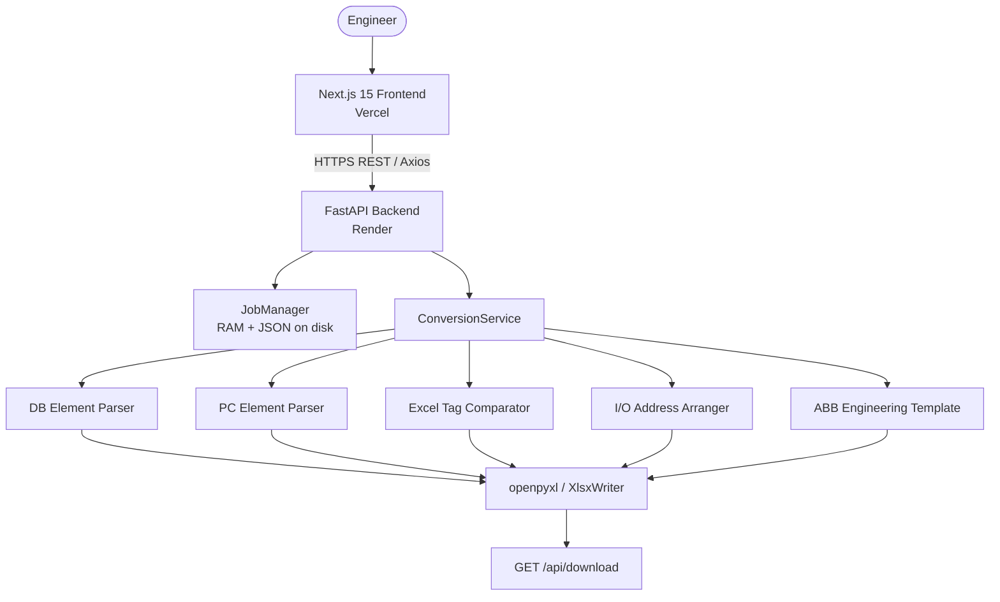

# ABB AC450 Migration Studio — Deployment Analysis & Implementation Plan

**Objective:** Deploy the application as a fully functional production system where **all five engineering services** work end-to-end—from file upload and extraction to Excel generation.

---

## Table of Contents

1. [Project Architecture](#1-project-architecture)
2. [Issues Found](#2-issues-found)
3. [GitHub Backend Upload Issue — Root Cause](#3-github-backend-upload-issue--root-cause)
4. [Required Fixes Before Deployment](#4-required-fixes-before-deployment)
5. [Recommended Free Deployment Architecture](#5-recommended-free-deployment-architecture)
6. [Step-by-Step Deployment Guide](#6-step-by-step-deployment-guide)
7. [Environment Variable Configuration](#7-environment-variable-configuration)
8. [GitHub Repository Preparation](#8-github-repository-preparation)
9. [Production Deployment Steps](#9-production-deployment-steps)
10. [End-to-End Production Testing Checklist](#10-end-to-end-production-testing-checklist)

---

## Project Modules

### Engineering Data Processing

| Service | `conversion_type` | Input |
| --- | --- | --- |
| DB Element Converter | `DB` | PDF(s) |
| PC Element Converter | `PC` | PDF(s) |
| Engineering Tag Comparator | `COMPARE` | Two Excel files |

### Engineering Output Generation

| Service | `conversion_type` | Input |
| --- | --- | --- |
| I/O Address Generator | `IO_ARRANGE` | One generated DB/PC Excel |
| ABB Engineering Template Generator | `ENG_TEMPLATE` | One generated DB/PC Excel |

---

## 1. Project Architecture



### Stack Summary

| Layer | Stack | Role |
| --- | --- | --- |
| Frontend | Next.js 15 App Router, React 18, Zustand, Axios, Tailwind | Single-page workflow UI |
| Backend | FastAPI + Uvicorn, Pydantic | Upload → queue → process → poll → download |
| PDF | pdfplumber + PyMuPDF | DB/PC text extraction |
| Excel | openpyxl, XlsxWriter, pandas | Generate / compare / rearrange |

### Shared API Surface (All Five Services)

| Step | Endpoint |
| --- | --- |
| Upload | `POST /api/upload` |
| Process | `POST /api/process` with `{ job_id, conversion_type }` |
| Poll | `GET /api/status/{job_id}` |
| Download | `GET /api/download/{job_id}` |
| Logs | `GET /api/logs/{job_id}` |
| Health | `GET /health` |

### Conversion Routing

Routing is handled in `ConversionService.run_conversion_pipeline`:

| UI Service | Type | Input | Engine |
| --- | --- | --- | --- |
| DB Element Converter | `DB` | PDF(s) | `backend/parser/*` + mapper + Excel |
| PC Element Converter | `PC` | PDF(s) | `backend/pc_element/parser/*` |
| Engineering Tag Comparator | `COMPARE` | 2 Excel files | `backend/excel_compare/*` |
| I/O Address Generator | `IO_ARRANGE` | 1 Excel | `backend/io_address_arrangement/*` |
| ABB Engineering Template | `ENG_TEMPLATE` | 1 Excel | `backend/engineering_template/*` |

- Frontend service pickers: `frontend/components/dropzone.tsx`
- API base URL resolution: `frontend/services/api_client.ts`

### Deployment Objective

The deployed application must be fully operational—not just the frontend. Every module must function as in local development:

- PDF uploads
- Excel uploads
- Backend processing
- PDF parsing
- Engineering data extraction
- Data transformation
- Excel generation
- File download
- API communication
- End-to-end workflow for all five services

---

## 2. Issues Found

### Frontend

- Production URL fallback is correct: `https://abb-ac450-migration-studio-backend.onrender.com/api`.
- `next.config.js` rewrites `/api/*` → `BACKEND_URL` or localhost — useful locally; production browser calls go **cross-origin** via `NEXT_PUBLIC_API_URL`, not via rewrites.
- Dev port is **5173** (`start_dev.bat` / `frontend/package.json`); README still says 3000 in places.
- Axios timeout is 300s; long jobs rely on fire-and-forget process + polling (up to 20 min) — OK if the backend stays warm and heartbeats continue.
- Cold Render starts can make the first upload fail before the client’s 5‑minute “no activity” timeout.

### Backend

- Temp paths use system temp (`/tmp/...`) — correct for Render’s ephemeral disk.
- Jobs persist to JSON under `LOG_DIR` — helps across process quirks, **not** across free-tier spin-down (filesystem wiped).
- Thread-pool executor avoids blocking the event loop (good for Render health checks).
- `backend/requirements.txt` is **missing** `pydantic-settings` (imported in `config.py`). Root `requirements.txt` has it — Render uses the root file, so deploy is OK; local `pip install -r backend/requirements.txt` alone will break.
- OCR (`ENABLE_PC_OCR`) is correctly disabled on Render free tier (OOM risk).
- README security note is outdated: uploads allow PDF **and** Excel.

### Frontend ↔ Backend Connectivity

- CORS: `allow_origins=["*"]` with `allow_credentials=False` — fine for this public tool.
- Env contract: frontend needs `NEXT_PUBLIC_API_URL=https://<render-host>/api` (with `/api`).

### Repository / Docs Drift

- README directory tree names many files that don’t match the live tree (`api.ts` vs `api_client.ts`, etc.).
- Root `vercel.json` builds frontend from monorepo root; README also says set Vercel **Root Directory** to `frontend` — pick one to avoid conflicting builds.
- `api/index.py` looks like a Vercel Python serverless entry — **not** viable for multi-minute PDF pipelines.

### Dependency Notes

| Area | Packages / Notes |
| --- | --- |
| Python (root `requirements.txt`) | fastapi, uvicorn, pydantic, pydantic-settings, python-multipart, pdfplumber, PyMuPDF, pandas, openpyxl, XlsxWriter, requests |
| Python (`backend/requirements.txt`) | Same set **except** missing `pydantic-settings` |
| Node (`frontend/package.json`) | next, react, axios, zustand, framer-motion, tanstack query, tailwind, lucide-react, typescript |
| Runtime | Python 3.11+, Node 18+ |
| Optional / disabled in prod | pytesseract + Pillow OCR (`ENABLE_PC_OCR=0`) |

---

## 3. GitHub Backend Upload Issue — Root Cause

### What is *not* the problem

`.gitignore` does **not** ignore the `backend/` package. It only skips:

- `backend/temp/`, `backend/logs/`
- `*.xlsx` (generated/sample workbooks)
- Python caches, `venv/`, `.next/`, `.env*`, etc.

### Actual root cause

Large parts of the backend—especially the three newer modules—are **local-only and never committed/pushed**.

Untracked examples commonly seen:

- `backend/excel_compare/`
- `backend/io_address_arrangement/`
- `backend/engineering_template/`
- Related tests and helpers

Plus many **modified** backend/frontend files that remain unstaged/uncommitted.

So GitHub (and thus Render) can still be an older snapshot **without** COMPARE / IO_ARRANGE / ENG_TEMPLATE even though they work on the local machine.

### Secondary confusion factors

1. **Vercel only deploys the frontend** — opening the Vercel project never shows a “backend deploy”; that is often misread as “backend isn’t on GitHub.”
2. **`.vercelignore` / `*.xlsx` / `*.pdf`** — sample files don’t push; source `.py` still should.
3. **`frontend/.next-dev/` is not ignored** — `git add .` can try to push a huge build cache, fail, or swamp the push UI.
4. Repo folder name has spaces — annoying for some scripts, not a Git ignore of `backend/`.

### Proper fix

1. Add ignore entries for `.next-dev/`, `tmp_out/`.
2. Stage **source only** (not `.next-dev`, not generated `.xlsx` outputs).
3. Commit and `git push` so GitHub contains the full `backend/` tree.
4. Confirm on GitHub.com that paths like `backend/engineering_template/generator.py` exist.
5. Trigger a Render redeploy from that commit.

---

## 4. Required Fixes Before Deployment

| Priority | Fix |
| --- | --- |
| P0 | Commit + push all five-service backend code and matching frontend |
| P0 | Verify GitHub has `excel_compare`, `io_address_arrangement`, `engineering_template` |
| P0 | Set Vercel `NEXT_PUBLIC_API_URL` to the live Render `/api` URL |
| P0 | Deploy backend from **repo root** with `pip install -r requirements.txt` and `uvicorn backend.main:app ...` (already in `render.yaml`) |
| P1 | Align `backend/requirements.txt` with root (add `pydantic-settings`) |
| P1 | Ignore `.next-dev/`, `tmp_out/` |
| P1 | Choose one Vercel setup: Root Directory = `frontend` **or** root `vercel.json` — not both conflicting |
| P1 | Do **not** host conversion on Vercel serverless (`api/index.py`) |
| P2 | UptimeRobot (or similar) ping `/health` every ~10–14 min |
| P2 | Document free-tier limits: ~512 MB RAM, spin-down, ephemeral disk, cold starts |

---

## 5. Recommended Free Deployment Architecture

### Option A — Split (Recommended): Vercel + Render

Already sketched in `README.md` / `render.yaml` / `vercel.json`.

| Aspect | Assessment |
| --- | --- |
| **Advantages** | Native Next.js on Vercel; native Python + PyMuPDF on Render; matches current code; free SSL; independent scaling |
| **Limitations** | CORS/env wiring; Render sleep + cold start; 512 MB RAM; ephemeral uploads |
| **Performance** | UI fast globally; first API call after idle can take 30–60s; large DB PDFs may OOM or run many minutes |
| **Reliability** | Good for demos/internal use if keep-alive + retry; not SLA-grade |
| **Maintenance** | Two dashboards; one GitHub repo → two auto-deploys |

```
                    +------------------------------------+
                    |            GitHub Repo             |
                    +-----------------+------------------+
                                      |
                      +---------------+---------------+
                      | (Git Push / Continuous Deploy) |
                      v                               v
      +-------------------------------+   +-------------------------------+
      |         Vercel Edge           |   |         Render Cloud          |
      |      (Frontend Hosting)       |   |       (Backend Hosting)       |
      |  - Next.js SSR & Static Assets|   |  - FastAPI (Python 3.11)      |
      |  - Free SSL (Let's Encrypt)   |   |  - PyMuPDF / pdfplumber       |
      +---------------+---------------+   +---------------+---------------+
                      |                               |
                      +--------------->---------------+
                             HTTPS REST API Calls
```

### Option B — Single Service (Docker / One Render Web Service)

Next build + static/SSR served beside Uvicorn (or Nginx reverse proxy) in one container.

| Aspect | Assessment |
| --- | --- |
| **Advantages** | One URL; no CORS; simpler env |
| **Limitations** | More Dockerfile/ops work; still Render free-tier RAM/sleep; Next + Python in one 512 MB box is tight; loses Vercel CDN |
| **Performance / reliability** | Worse headroom for PDF jobs |
| **Maintenance** | One deploy, heavier image builds |

### Option C — Everything on Vercel (including `api/index.py`)

**Not feasible** for this app: serverless timeouts, no durable local disk for job lifecycle, PDF/native libs and long CPU work are poor fits.

### Verdict

Use **Option A: Vercel (frontend) + Render (backend)**.

A true single free service is possible only with a custom container and weaker PDF reliability—not worth it for this workload.

---

## 6. Step-by-Step Deployment Guide

### 6.1 Prerequisites

- GitHub account with this repository pushed (complete backend included)
- Vercel account (Hobby / free)
- Render account (free web service)
- Optional: UptimeRobot account for keep-alive pings

### 6.2 Prepare the repository

See [Section 8](#8-github-repository-preparation).

### 6.3 Deploy backend on Render

1. Open [render.com](https://render.com) → New → Blueprint, or Web Service from the GitHub repo.
2. Use existing `render.yaml` (or equivalent settings):
   - **Build:** `pip install -r requirements.txt`
   - **Start:** `uvicorn backend.main:app --host 0.0.0.0 --port $PORT --workers 1`
   - **Health check path:** `/health`
   - **Python:** 3.11
   - **Env:** `PC_LIGHT_PDF_READ=1`, `ENABLE_PC_OCR=0`
3. Note the public URL, e.g. `https://abb-ac450-migration-studio-backend.onrender.com`
4. Open `/health` and `/docs` once the service is warm.
5. Optional: configure UptimeRobot HTTP monitor → `/health` every 10–14 minutes.

### 6.4 Deploy frontend on Vercel

1. Import the same GitHub repo into [vercel.com](https://vercel.com).
2. **Root Directory:** `frontend` (recommended; then ignore or later remove conflicting root `vercel.json`).
3. Framework: Next.js; build command `npm run build`; output default `.next`.
4. Set environment variable `NEXT_PUBLIC_API_URL` (see [Section 7](#7-environment-variable-configuration)).
5. Deploy. Open the Vercel URL and confirm Network calls hit Render, not `127.0.0.1`.

### 6.5 Verify connectivity

1. From the browser DevTools Network tab, confirm requests go to `https://<render-host>/api/...`.
2. Hit `GET /health` on Render — expect `"status": "online"` and writable filesystem fields.
3. Run one PDF and one Excel workflow smoke test before full checklist.

---

## 7. Environment Variable Configuration

### Vercel (Frontend)

| Variable | Required | Example | Description |
| --- | :---: | --- | --- |
| `NEXT_PUBLIC_API_URL` | Yes | `https://abb-ac450-migration-studio-backend.onrender.com/api` | Backend REST API base URL (must include `/api`) |

Local override (`frontend/.env.local`):

```env
NEXT_PUBLIC_API_URL=http://127.0.0.1:8000/api
```

### Render (Backend)

| Variable | Recommended | Description |
| --- | --- | --- |
| `PYTHON_VERSION` | `3.11.0` | Python runtime |
| `PORT` | Provided by Render | Uvicorn bind port |
| `PC_LIGHT_PDF_READ` | `1` | Lighter PC PDF read path (lower memory) |
| `ENABLE_PC_OCR` | `0` | Disable OCR on free tier (OOM risk) |
| `PROJECT_NAME` | Default OK | Service title |
| `VERSION` | Default OK | Semantic version |
| `API_PREFIX` | `/api` | Global REST router prefix |

No database or Redis is required for the free deploy (in-memory jobs + temp JSON persistence).

### Root `.env.example` Reference

```env
# Frontend
NEXT_PUBLIC_API_URL=https://abb-ac450-migration-studio-backend.onrender.com/api

# Backend
PROJECT_NAME="ABB AC450 DB Element Converter"
VERSION="1.0.0"
API_PREFIX="/api"
PORT=8000
```

---

## 8. GitHub Repository Preparation

### Suggested `.gitignore` additions

```gitignore
.next-dev/
frontend/.next-dev/
tmp_out/
```

### Commit and push (source only)

```powershell
# From repo root — do NOT add .next-dev or generated xlsx
git status

git add backend frontend docs requirements.txt render.yaml vercel.json package.json .env.example .gitignore README.md api start_dev.bat
# Prefer explicit paths over `git add .` until .next-dev is ignored

git commit -m "Ship all five engineering conversion services for production deploy."
git push -u origin HEAD
```

### Confirm on GitHub.com

Verify at least these paths exist remotely:

- `backend/main.py`
- `backend/excel_compare/`
- `backend/io_address_arrangement/`
- `backend/engineering_template/`
- `frontend/services/api_client.ts`
- `requirements.txt`
- `render.yaml`

---

## 9. Production Deployment Steps

Recommended order:

1. **Push** complete backend + frontend source to GitHub.
2. **Deploy / redeploy Render** from that commit; verify `GET /health`.
3. **Set** Vercel `NEXT_PUBLIC_API_URL` to the live Render `/api` URL.
4. **Deploy** frontend on Vercel.
5. **Smoke-test** one PDF workflow (DB or PC) and one Excel workflow (COMPARE / IO_ARRANGE / ENG_TEMPLATE).
6. **Enable** keep-alive ping on `/health`.
7. **Run** the full five-service checklist below.
8. Only then treat the deployment as complete.

### Warm-up monitor (Render free tier)

Render free web services spin down after ~15 minutes of inactivity. Cold starts often take 30–60 seconds.

Configure UptimeRobot (or equivalent) to ping:

```text
https://<your-backend>.onrender.com/health
```

every **10–14 minutes**.

### Free-tier operational expectations

| Constraint | Impact |
| --- | --- |
| ~512 MB RAM | Very large PDFs may OOM |
| Spin-down after idle | Cold start delay; first request may fail — retry |
| Ephemeral filesystem | Uploads/outputs lost on restart or sleep — re-run job |
| Single instance | No horizontal scale; in-memory job state is per instance |

---

## 10. End-to-End Production Testing Checklist

For each service: **upload → process → poll until `completed` → download `.xlsx` → open in Excel**.

### Engineering Data Processing

#### 1. DB Element Converter

- [ ] Select **DB Element Converter**; upload AC450 DB PDF
- [ ] Progress moves through phases; heartbeats refresh `updated_at`
- [ ] Results show object counts / sheets / preview
- [ ] Download is named from source PDF basename `.xlsx`
- [ ] Clubbed I/O / expected sheets are present

#### 2. PC Element Converter

- [ ] Select **PC Element Converter**; upload PC Element PDF
- [ ] Completes without OCR (unless intentionally enabled)
- [ ] Download opens; I/O list content is present

#### 3. Engineering Tag Comparator

- [ ] Upload two Excel files containing `$(DEVICETAG)`
- [ ] Status metrics show worksheet counts, matched/unmatched
- [ ] Download `Comparison_Report.xlsx`

### Engineering Output Generation

#### 4. I/O Address Generator

- [ ] Upload one **generated** DB or PC workbook
- [ ] Completes; category sheets with addresses appear
- [ ] Download `IO_Address_Arrangement.xlsx`
- [ ] Addresses stay within hardware channel limits

#### 5. ABB Engineering Template Generator

- [ ] Upload one generated DB or PC workbook
- [ ] Completes; paired/singleton metrics appear
- [ ] Download `ABB_Engineering_Template.xlsx`

### Cross-Cutting Production Checks

- [ ] After 15+ min idle: first request may cold-start; retry succeeds
- [ ] Mid-job Render restart: job fails or file missing → re-run works (expected on free tier)
- [ ] CORS: browser console has no blocked requests from Vercel → Render
- [ ] Files &gt; 100 MB rejected with a clear API error
- [ ] Wrong extension rejected

---

## Bottom Line

The app is designed as a **decoupled Next.js + FastAPI** converter with five `conversion_type` pipelines sharing one job API.

The blocking deployment gap is **not** `.gitignore` wiping `backend/`—it is **uncommitted/unpushed backend (and frontend) work**, especially the three Excel modules (`excel_compare`, `io_address_arrangement`, `engineering_template`).

**Recommended production path:**

1. Sync the full project to GitHub.
2. Deploy with **Vercel (frontend) + Render (backend)**.
3. Set `NEXT_PUBLIC_API_URL`.
4. Keep the API warm.
5. Confirm all five engineering services with the checklist above.

---

*Document generated from the Deployment Analysis & Implementation Plan for ABB AC450 Migration Studio.*
