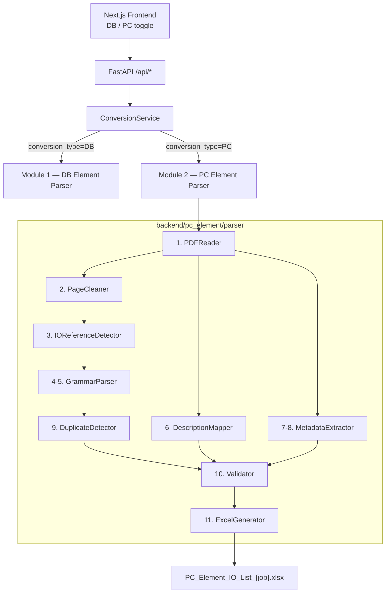

# Module 2 — PC Element Converter

## Purpose

The PC Element Converter reads ABB AC450 **PC DIAGRAM** PDFs (function-block / hardwired I/O drawings) and extracts every I/O address reference into a Valmet-ready Excel sheet.

Unlike DB Elements (parameter listings), PC diagrams mainly contain address strings such as:

| Example | Meaning |
|---------|---------|
| `=AI1.1/940LC391.MV` | Standard analog input |
| `=AI800_1.1/940LC391.MV` | 800-series analog input |
| `=AOC264:17/949DKA050.KEY:SELECTED` | AOC port + attribute |
| `=AOC262/M49DKA050.KEY` | AOC without channel |
| `P-=AOC195/M49ARA106.CA41` | Physical output-side prefix |

---

## Architecture



### Module connectivity

| Layer | Path | Role |
|-------|------|------|
| Frontend | `frontend/components/dropzone.tsx` | User selects **PC Element** |
| API | `POST /api/process` with `conversion_type=PC` | Starts job |
| Orchestrator | `backend/services/conversion_service.py` | Routes to modular PC pipeline |
| Engine | `backend/pc_element/parser/*` | 11-stage extraction |
| Download | `GET /api/download/{job_id}` | Returns generated Excel |

DB and PC share upload, job store, status polling, and download. Parser stacks are fully isolated.

---

## Pipeline Stages

| Stage | Component | Responsibility |
|-------|-----------|----------------|
| 1 | `pdf_reader.py` | pdfplumber + PyMuPDF fallback; spatial word rebuild for CAD text |
| 2 | `page_cleaner.py` | Strip ABB copyright / title-block noise |
| 3 | `io_reference_detector.py` | Regex scan for I/O candidates (standard, port, no-channel, `P-` prefixes) |
| 4–5 | `grammar_parser.py` | Split into Category, Card, Channel, Device Tag, Loop Tag |
| 6 | `description_mapper.py` | Map loop tag → nearby engineering description (blank if absent) |
| 7–8 | `metadata_extractor.py` | Controller / process area from title block |
| 9 | `duplicate_detector.py` | Collapse attribute variants (`KEY:SELECTED` / `KEY:MAN` → one `KEY`) |
| 10 | `validator.py` | Accept all supported families; allow channel `0` |
| 11 | `excel_generator.py` | Valmet single-sheet workbook |

---

## Parsing Logic

For every detected reference:

1. **Category** — `AI`, `AO`, `DI`, `DO`, `AI800`, `AO800`, `DI800`, `DO800`, plus diagram types `AOC`, `ACC`, `AIC`, `DOC`, `DIC`, `AICT`, `DICT`
2. **Slot/Card** — numeric address before `.` / `:` / `/`
3. **Channel / Port** — after `.` or `:`; `0` when omitted (`=AOC262/tag`)
4. **Device Tag** — text after `/`, with colon attributes stripped (`KEY:SELECTED` → `KEY`)
5. **Loop Tag** — device tag without final `.EXTENSION`
6. **Description** — from nearby PDF text when present; otherwise blank

### Supported address patterns

```
Standard:   [=|-|P-=]* PREFIX CARD . CHANNEL / DEVICE_TAG
Port-style: [=|-|P-=]* PREFIX CARD : PORT    / DEVICE_TAG[:ATTR]
No-channel: [=|-|P-=]* PREFIX CARD           / DEVICE_TAG
800-series: PREFIX800_ CARD . CHANNEL / DEVICE_TAG
```

---

## Excel Output

**File:** `PC_Element_IO_List_{job_id}.xlsx`  
**Sheet:** `I_O_List`

| Column | Source |
|--------|--------|
| Sr. No. | Sequential |
| Loop Tag | Derived from device tag |
| Description | Mapped or blank |
| Device Tag | Normalized tag after `/` |
| Category | `AI` / `AI800` / `AOC` / … |

Example:

| Sr. No. | Loop Tag | Description | Device Tag | Category |
|--------:|----------|-------------|------------|----------|
| 1 | 940LC391 | PURE WTR. TK. LVL. | 940LC391.MV | AI |
| 2 | M49DKA050 | | M49DKA050.KEY | AOC |
| 3 | M49ARA106 | | M49ARA106.CA41 | AOC |

---

## Validation Report (O2-PC32.pdf reference)

End-to-end run against  
`c:\Users\vedan\Downloads\Testing Material\Project references\O2_LOGIC_PDF\O2-PC32.pdf`:

| Metric | Value |
|--------|------:|
| Document pages | 57 |
| Detectable I/O inventory | 233 |
| Extracted records | **233** |
| Missing | **0** |
| Extra (false positives) | **0** |
| Parser accuracy | **100.0%** |
| Duplicates removed | exact duplicates only |
| Descriptions present | 0 (PC DIAGRAM sheets have no tag description annotations) |

### Category breakdown

| Category | Count |
|----------|------:|
| AOC | 179 |
| AI800 | 32 |
| AIC | 14 |
| AI | 5 |
| DOC | 3 |

### Completeness notes (not parser misses)

- **No DI / DO / AO / AO800 / DI800 / DO800** appear in this PDF’s selectable text layer.
- DOC (digital output config) is present (3); no matching DI in the same document — flagged in the validation report for manual review.
- Descriptions are blank because the drawing title block “Item des.” fields are empty and no nearby engineering prose labels exist for loop tags.

Each conversion now writes:
- `PC_Element_IO_List_{job}.xlsx`
- `PC_Element_Validation_Report_{job}.txt` / `.json`

---

## Root Cause of Prior Failure

Grammar detection already found AOC/AIC/DOC references, but **Stage 10 Validator** only allowed `AI/AO/DI/DO` (+ 800-series) and rejected `channel_number == 0`. Nearly all diagram I/O was discarded before Excel generation.

### Fixes applied

1. Extended prefix set (`AOC`, `ACC`, `AIC`, …) end-to-end  
2. Validator accepts extended families and channel `0`  
3. Strip `P-` / `-P-` diagram prefixes  
4. Normalize `:ATTR` suffixes on device tags  
5. Deduplicate by `(category, device_tag)`  
6. Excel columns match Valmet PC Element format  
7. Category code for 800-series is `AI800` (not collapsed to `AI`)  
8. Fixed `DO800_` → `io_type=DO` typo  

---

## File Map

```
backend/pc_element/
  __init__.py
  parser/
    pdf_reader.py
    page_cleaner.py
    io_reference_detector.py
    grammar_parser.py
    description_mapper.py
    metadata_extractor.py
    duplicate_detector.py
    validator.py
    excel_generator.py
    parser_service.py          ← orchestrator

backend/services/conversion_service.py   ← wires PC path into API
backend/tests/test_pc_element_parser.py  ← unit + pipeline tests
```

---

## How to Run

1. Start backend + frontend  
2. Upload a PC DIAGRAM PDF  
3. Select **PC Element**  
4. Process → download `PC_Element_IO_List_*.xlsx`

Or programmatically:

```python
from backend.pc_element.parser.parser_service import PCParserService
res = PCParserService("O2-PC32.pdf", "job1", "./out").execute_pipeline()
print(res.total_io_found, res.excel_file_path)
```

---

## Extensibility

New ABB prefixes: add to `PREFIX_MAP` / `_PREFIX_ORDER` in `grammar_parser.py` and the matching alternation in `io_reference_detector.py`, then add the code to `Validator.VALID_FAMILIES` / `VALID_CATEGORIES`.
